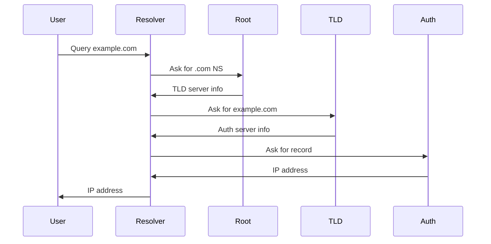
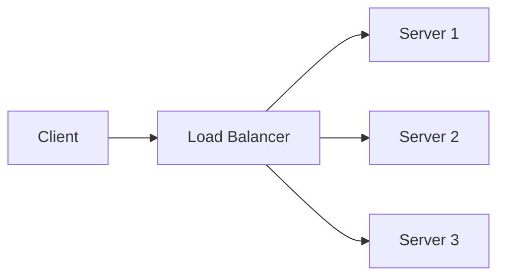
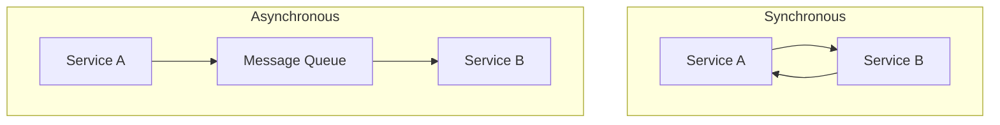
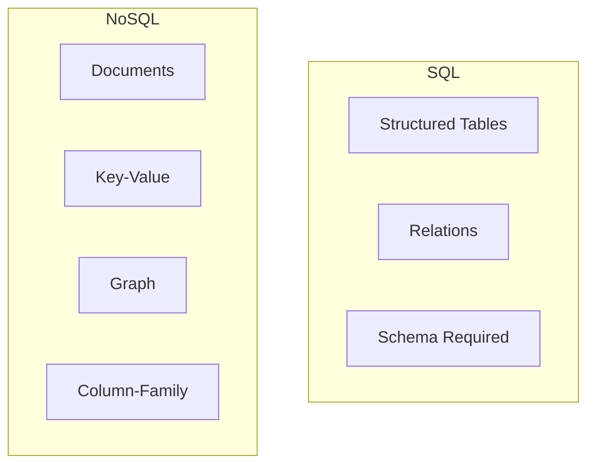
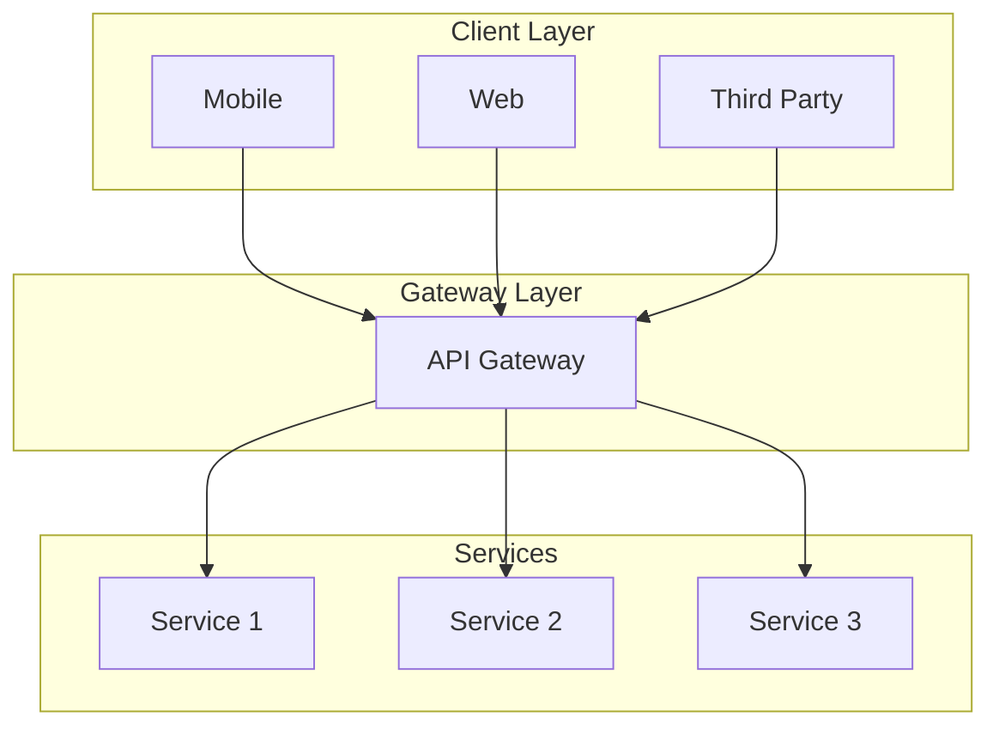
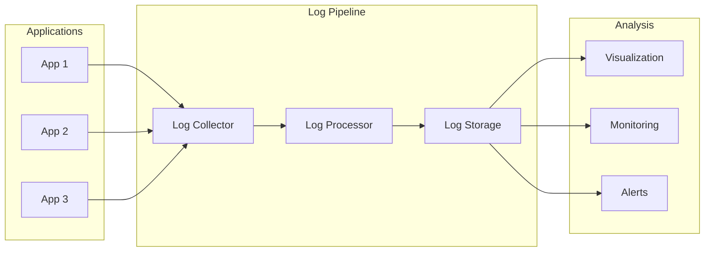
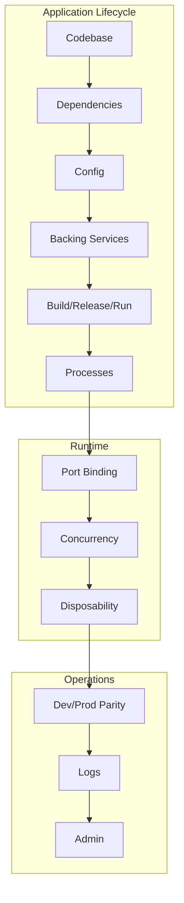

# DevOps & System Architecture — Course Guide

Welcome — this repo is a compact course folder with short, practical lectures and diagrams you can read or run locally.

## Quick start

- Open `lectures/` and pick a numbered lecture to start (1 → 4 so far).
- Use VS Code Markdown preview to render Mermaid diagrams.
- For hands-on scripts, see `lectures/04_shell_scripting.md` and copy the example scripts into an `examples/` folder (optional).

## Course map (intuitive)

- Lecture 1 — Microservices architecture: concepts, diagrams, pros/cons.
- Lecture 2 — DevOps introduction: culture, lifecycle, principles, tools.
- Lecture 3 — Essential commands & AWS: CLI + Console basics, Docker quick-ops.
- Lecture 4 — Shell scripting: recipes, examples, ACLs, assignment (utils + setup scripts).
- Lecture 5 — Git basics: local vs remote vs distributed, install, init, clone, add, commit, push, log, diff, branching, and more.
- Lecture 6 — Containerization & Docker: what is containerization, what is Docker, why use Docker, Docker architecture, images, containers, networks, volumes, and Compose.
- Lecture 7 — Docker Volumes: tmpfs, bind mounts, Docker volumes, anonymous vs named volumes, persistence, backup/restore, best practices.

## Today's progress / study note

- Studied: DevOps culture and SDLC integration.
- Takeaway: "DevOps is a culture and set of practices focused on delivering applications faster while maintaining higher quality and testability across the SDLC (collaboration + automation + measurement)."

## How to use this repo

1. Preview: open any `lectures/*.md` in VS Code and toggle Markdown preview (Ctrl/Cmd+Shift+V).
2. Run examples: copy script snippets from the lecture into a file, make it executable and run:

```bash
chmod +x script.sh
./script.sh
```

3. If a lecture refers to `utils.sh` or `setup_project.sh`, create them under an `examples/` folder or run them directly from lecture instructions.

## Where to go next

- Want runnable examples added? I can create an `examples/` folder with each script as a separate file.
- Want CI checks? I can add a simple GitHub Actions workflow to run `shellcheck` on `.sh` files.

## Getting Started (details)

Each lecture is contained in its own markdown file in the `lectures` directory. The lectures include:
- detailed explanations
- mermaid diagrams for visualization
- practical examples and copy-pasteable scripts
- best practices and further reading




Key components:
- DNS Resolver
- Root Nameservers
- TLD (Top-Level Domain) Servers
- Authoritative Nameservers

## 3. Load Balancers

Load balancers distribute incoming network traffic across multiple servers to ensure high availability and reliability.



Common algorithms:
- Round Robin
- Least Connections
- IP Hash
- Weighted Round Robin

## 4. Synchronous vs Asynchronous Communication



Synchronous:
- Immediate response
- Direct service-to-service communication
- Blocking operations

Asynchronous:
- Decoupled services
- Message/event-based
- Non-blocking operations

## 5. SQL vs NoSQL Database



SQL:
- Structured data
- ACID compliance
- Fixed schema
- Relational data

NoSQL:
- Flexible schema
- Horizontal scaling
- Various data models
- Eventually consistent

## 6. API Gateway

API Gateway serves as the single entry point for all clients, handling requests by routing them to the appropriate microservice.



Key features:
- Authentication
- Rate limiting
- Request routing
- Response transformation
- Monitoring

## 7. Externalizing Logs



Benefits:
- Centralized logging
- Real-time monitoring
- Better debugging
- Compliance and audit
- Scalable storage

## 8. 12 Factor Apps

The twelve factors for building modern, scalable applications:

1. Codebase: One codebase tracked in revision control, many deploys
2. Dependencies: Explicitly declare and isolate dependencies
3. Config: Store config in the environment
4. Backing services: Treat backing services as attached resources
5. Build, release, run: Strictly separate build and run stages
6. Processes: Execute the app as one or more stateless processes
7. Port binding: Export services via port binding
8. Concurrency: Scale out via the process model
9. Disposability: Maximize robustness with fast startup and graceful shutdown
10. Dev/prod parity: Keep development, staging, and production as similar as possible
11. Logs: Treat logs as event streams
12. Admin processes: Run admin/management tasks as one-off processes



These principles ensure:
- Maximum portability
- Continuous deployment
- Horizontal scalability
- Maintainable codebase