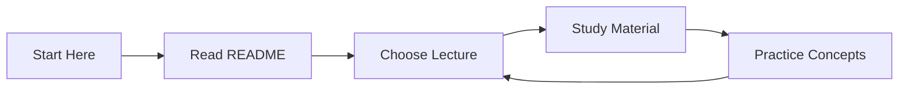
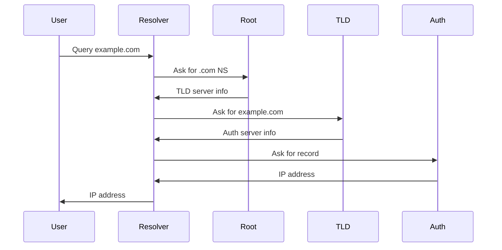
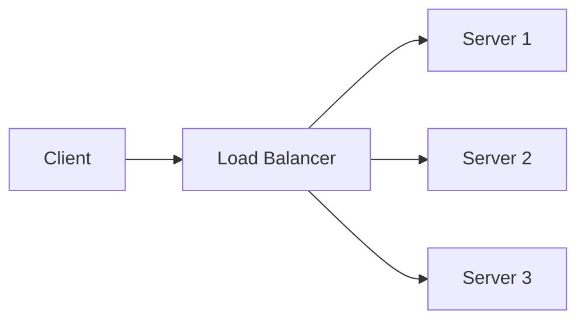
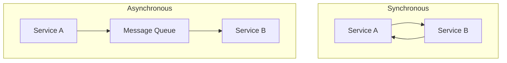
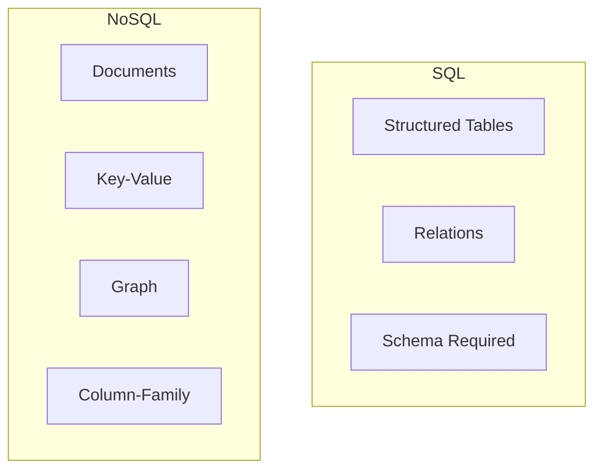
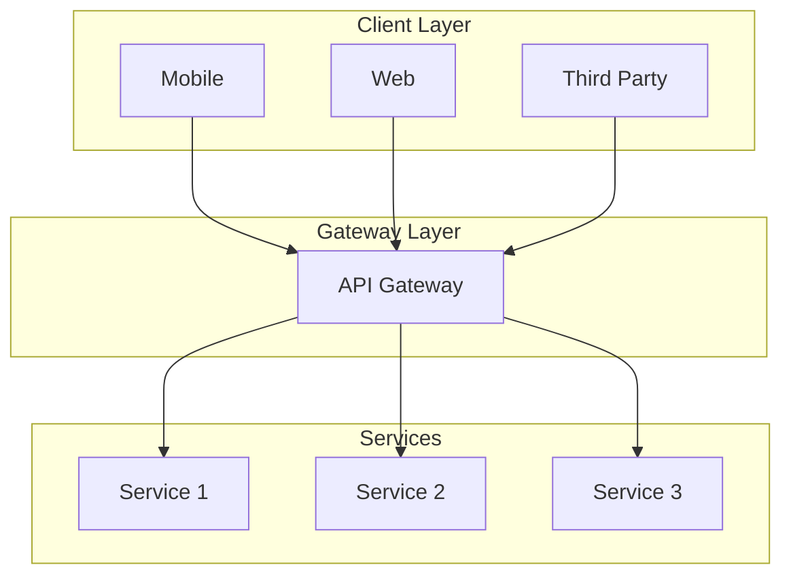
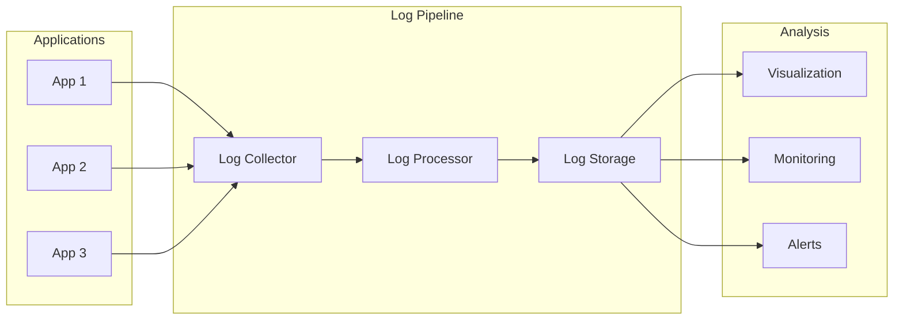
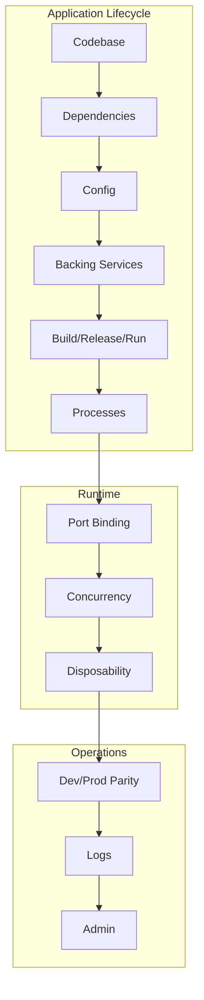

# DevOps and System Architecture Course

Welcome to the comprehensive DevOps and System Architecture course. This repository contains detailed lectures and materials covering essential concepts in modern software architecture and DevOps practices.

## Course Structure

### Completed Lectures

1. [Introduction to Microservices Architecture](./lectures/01_microservices_architecture.md)
   - Understanding microservices
   - Key characteristics
   - Benefits and challenges
   - Best practices
   - Real-world examples

2. [Introduction to DevOps](./lectures/02_devops_introduction.md)
   - What is DevOps
   - DevOps lifecycle
   - DevOps principles (CALMS)
   - DevOps practices
   - Tools and technologies
   - Best practices and implementation

3. [Essential Commands and AWS Setup](./lectures/03_essential_commands.md)
   - Basic Linux commands
   - File and process management
   - AWS setup and SSH access
   - Docker basics
   - Practical examples and troubleshooting
   - Best practices and security

### Upcoming Lectures

4. DNS (Domain Name System)
3. Load Balancers
4. Synchronous vs Asynchronous Communication
5. SQL vs NoSQL Databases
6. API Gateway
7. Externalizing Logs
8. 12 Factor Apps

## Getting Started

Each lecture is contained in its own markdown file in the `lectures` directory. The lectures include:
- Detailed explanations
- Visual diagrams using Mermaid
- Real-world examples
- Best practices
- Further reading suggestions

Key characteristics:
- Independently deployable services
- Decentralized data management
- Built around business capabilities
- Failure isolation
- Scalable components

## 2. DNS (Domain Name System)

DNS is the internet's phonebook that translates human-readable domain names into IP addresses.

Key components:
- DNS Resolver
- Root Nameservers
- TLD (Top-Level Domain) Servers
- Authoritative Nameservers

## 3. Load Balancers

Load balancers distribute incoming network traffic across multiple servers to ensure high availability and reliability.

Common algorithms:
- Round Robin
- Least Connections
- IP Hash
- Weighted Round Robin

## 4. Synchronous vs Asynchronous Communication

Synchronous:
- Immediate response
- Direct service-to-service communication
- Blocking operations

Asynchronous:
- Decoupled services
- Message/event-based
- Non-blocking operations

## 5. SQL vs NoSQL Database

SQL:
- Structured data
- ACID compliance
- Fixed schema
- Relational data

NoSQL:
- Flexible schema
- Horizontal scaling
- Various data models
- Eventually consistent

## 6. API Gateway

API Gateway serves as the single entry point for all clients, handling requests by routing them to the appropriate microservice.

Key features:
- Authentication
- Rate limiting
- Request routing
- Response transformation
- Monitoring

## 7. Externalizing Logs

Benefits:
- Centralized logging
- Real-time monitoring
- Better debugging
- Compliance and audit
- Scalable storage

## 8. 12 Factor Apps

The twelve factors for building modern, scalable applications:

1. Codebase: One codebase tracked in revision control, many deploys
2. Dependencies: Explicitly declare and isolate dependencies
3. Config: Store config in the environment
4. Backing services: Treat backing services as attached resources
5. Build, release, run: Strictly separate build and run stages
6. Processes: Execute the app as one or more stateless processes
7. Port binding: Export services via port binding
8. Concurrency: Scale out via the process model
9. Disposability: Maximize robustness with fast startup and graceful shutdown
10. Dev/prod parity: Keep development, staging, and production as similar as possible
11. Logs: Treat logs as event streams
12. Admin processes: Run admin/management tasks as one-off processes

These principles ensure:
- Maximum portability
- Continuous deployment
- Horizontal scalability
- Maintainable codebase