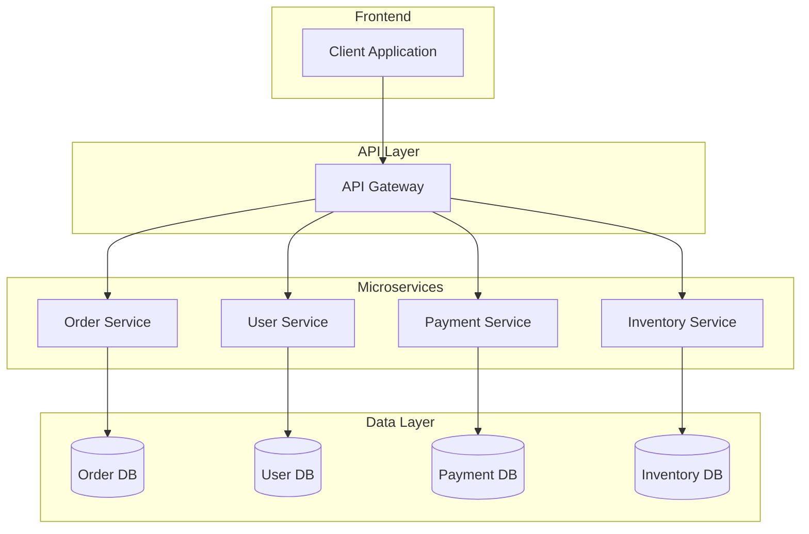

# Lecture 1: Introduction to Microservices Architecture

## What are Microservices?

Microservices is an architectural style that structures an application as a collection of small autonomous services, modeled around a business domain. Each service is self-contained and implements a single business capability.

## Key Characteristics

1. **Decentralization**
   - Each service has its own database
   - Independent deployment
   - Technology heterogeneity

2. **Business-Focused**
   - Organized around business capabilities
   - Cross-functional teams
   - Products not projects

3. **Smart Endpoints & Dumb Pipes**
   - Simple REST APIs or messaging
   - Avoid complex ESB
   - Decentralized governance

## Typical Architecture

## Benefits

1. **Scalability**
   - Independent scaling of services
   - Better resource utilization
   - Flexible deployment options

2. **Resilience**
   - Failure isolation
   - Graceful degradation
   - Independent recovery

3. **Agility**
   - Faster time to market
   - Independent development teams
   - Technology flexibility

4. **Maintainability**
   - Smaller, focused codebases
   - Easier to understand
   - Simpler deployment units

## Challenges

1. **Distributed System Complexity**
   - Network latency
   - Service discovery
   - Data consistency

2. **Operational Overhead**
   - Multiple databases
   - Multiple deployments
   - Monitoring complexity

3. **Testing Challenges**
   - Integration testing
   - End-to-end testing
   - Service dependencies

## Best Practices

1. **Single Responsibility**
   - One service, one business capability
   - Clear boundaries
   - Independent evolution

2. **Data Management**
   - Private databases per service
   - Event-driven updates
   - Eventually consistent

3. **Service Discovery**
   - Service registry
   - Load balancing
   - Health checking

4. **Fault Tolerance**
   - Circuit breakers
   - Fallback mechanisms
   - Retry policies

## Real-World Examples

1. **Netflix**
   - Hundreds of microservices
   - Cloud-native architecture
   - Open-source tools

2. **Amazon**
   - Service-oriented architecture
   - Two-pizza teams
   - Independent service evolution

3. **Uber**
   - Domain-driven design
   - Polyglot persistence
   - Event-driven architecture

## Getting Started

1. **Start Small**
   - Begin with monolith
   - Extract services gradually
   - Learn from experience

2. **Choose Boundaries**
   - Business capabilities
   - Data ownership
   - Team structure

3. **Infrastructure First**
   - CI/CD pipeline
   - Monitoring
   - Service mesh

## Further Reading

1. Building Microservices by Sam Newman
2. Domain-Driven Design by Eric Evans
3. Microservices Patterns by Chris Richardson

## Next Steps

- Understanding service communication patterns
- Implementing service discovery
- Setting up monitoring and logging
- Designing for failure