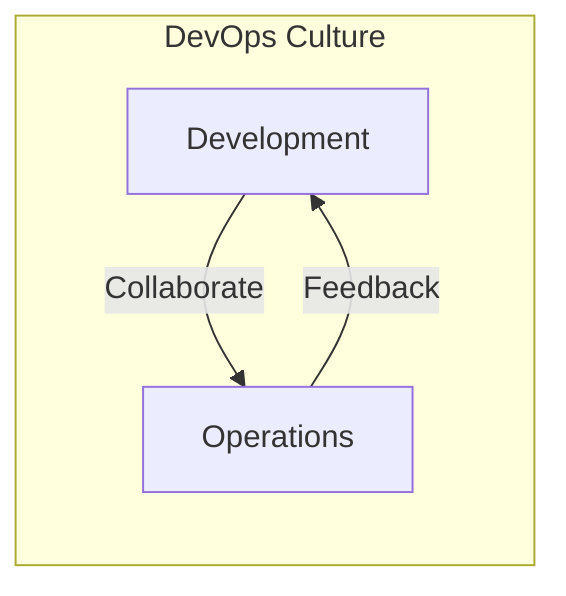
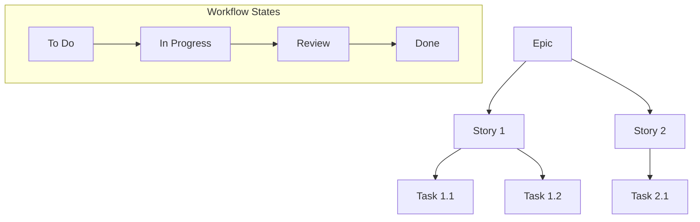
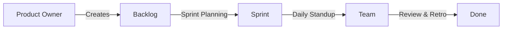
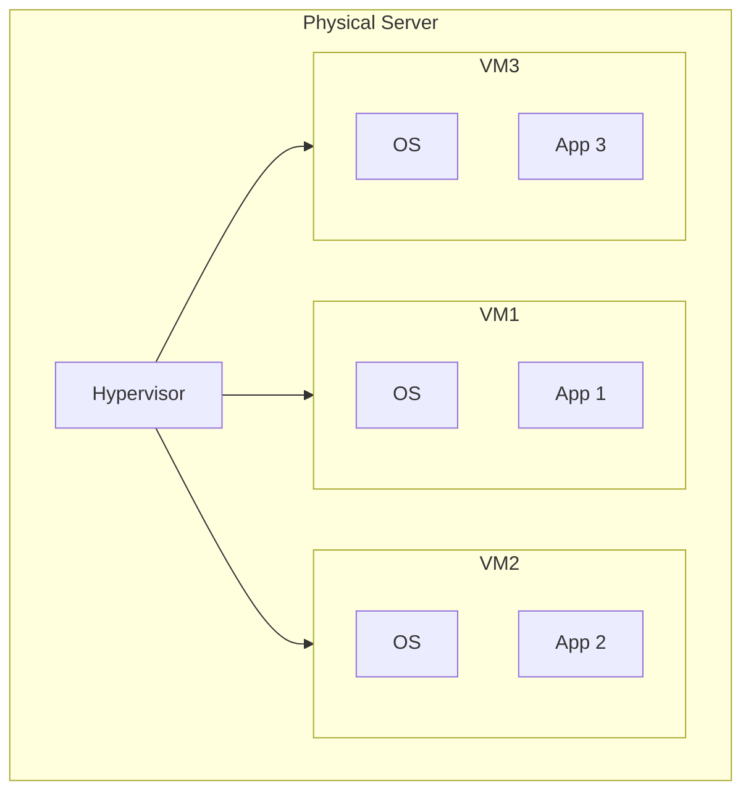
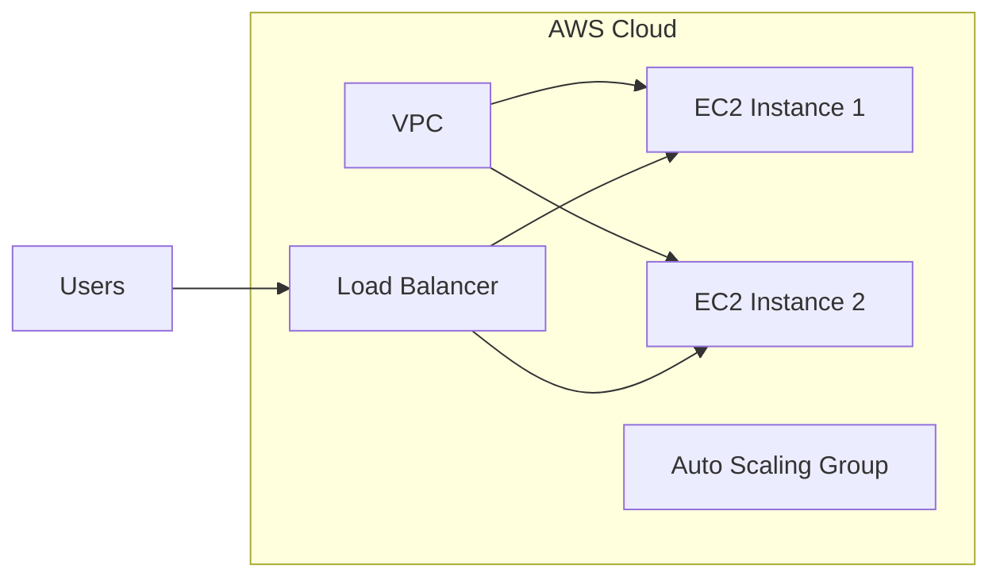
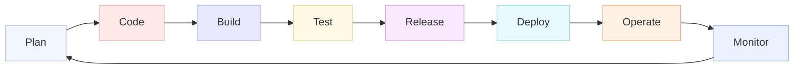
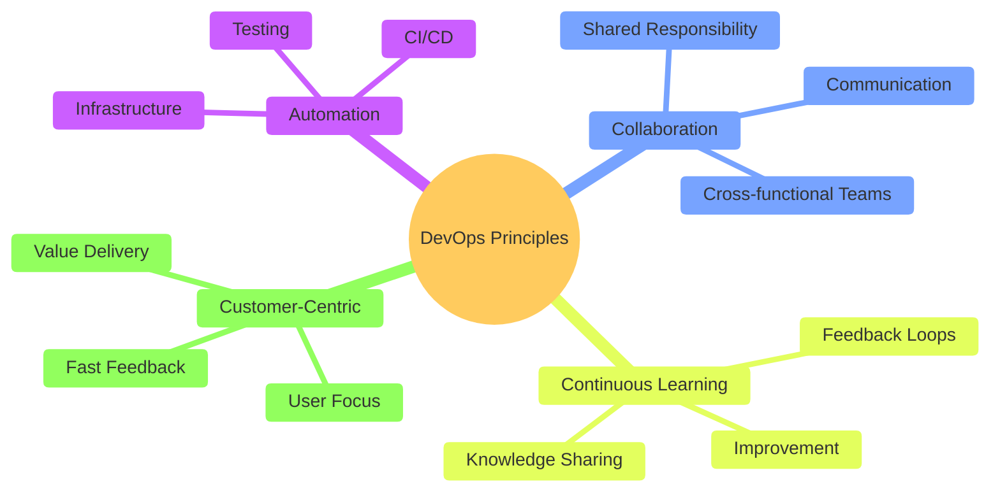
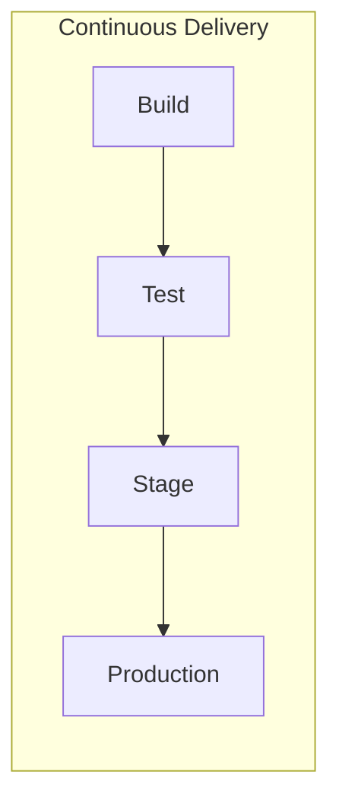
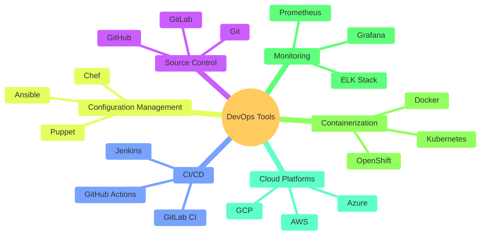

# Lecture 2: Introduction to DevOps

## What is DevOps?

DevOps is a set of practices that combines software development (Dev) and IT operations (Ops). It aims to shorten the systems development life cycle and provide continuous delivery with high software quality.

### Today's takeaway

DevOps is a culture and set of practices focused on delivering applications faster while maintaining higher quality and testability across the software development lifecycle (SDLC). This emphasizes collaboration, automation, measurement and continuous improvement to make delivery predictable and resilient. Key enablers include Jira for agile workflow management and virtual machines for efficient resource utilization.

## Agile Project Management with Jira

### Understanding Jira Workflow

### Hierarchy of Work Items

1. **Epic**
   - Large body of work
   - Can span multiple sprints
   - Example: "User Authentication System"

2. **Story**
   - User-centric feature description
   - Completable within one sprint
   - Example: "As a user, I can reset my password"

3. **Task**
   - Specific technical work items
   - Usually assigned to one person
   - Example: "Implement password reset API endpoint"

### Scrum Team Workflow

1. **Sprint Planning**
   - Select stories for sprint
   - Break into tasks
   - Estimate effort

2. **Daily Work**
   - Update ticket status
   - Log work hours
   - Add comments and attachments

3. **Board Views**
   - Scrum board
   - Kanban board
   - Backlog view

## Virtual Machines in DevOps

### Understanding Virtual Machines

### VM vs Physical Server

| Aspect | Physical Server | Virtual Machine |
|--------|----------------|-----------------|
| Resource Utilization | Often underutilized | Efficient sharing |
| Scalability | Hardware limited | Easy to scale |
| Cost | High upfront | Pay as you go |
| Deployment Time | Days/Weeks | Minutes |
| Maintenance | Complex | Simplified |

### Cloud VMs (e.g., AWS EC2)

1. **Benefits**
   - On-demand provisioning
   - Pay-per-use pricing
   - Multiple instance types
   - Geographic distribution

2. **Common Uses**
   - Application servers
   - Development environments
   - Testing environments
   - CI/CD runners

3. **Management Features**
   - Auto-scaling
   - Load balancing
   - Snapshots and backups
   - Security groups

## Why Do You Need DevOps?

1. **Faster Time to Market**
   - Reduced development cycles
   - Faster deployment frequency
   - Quicker time to recovery

2. **Better Collaboration**
   - Breaking down silos
   - Shared responsibility
   - Improved communication

3. **Quality and Reliability**
   - Automated testing
   - Continuous monitoring
   - Reduced failure rates

4. **Cost Efficiency**
   - Automated processes
   - Better resource utilization
   - Reduced overhead

## DevOps Lifecycle

### Phases Explained:

1. **Plan**
   - Requirements gathering
   - Sprint planning
   - Backlog management

2. **Code**
   - Version control (Git)
   - Code review
   - Integration

3. **Build**
   - Compilation
   - Packaging
   - Containerization

4. **Test**
   - Unit testing
   - Integration testing
   - Performance testing

5. **Release**
   - Version management
   - Approval process
   - Release notes

6. **Deploy**
   - Infrastructure as Code
   - Configuration management
   - Deployment automation

7. **Operate**
   - System operations
   - Service management
   - User support

8. **Monitor**
   - Performance monitoring
   - Log analysis
   - User metrics

## DevOps Principles

1. **The Three Ways**
   - **Flow**: Left to right
   - **Feedback**: Right to left
   - **Continuous Learning**: Experimentation and practice

2. **CALMS Framework**
   - Culture
   - Automation
   - Lean
   - Measurement
   - Sharing

## DevOps Practices

### 1. Continuous Integration (CI)

### 2. Continuous Delivery/Deployment (CD)

### 3. Infrastructure as Code (IaC)
- Version-controlled infrastructure
- Automated provisioning
- Configuration management

### 4. Monitoring and Logging
- Real-time monitoring
- Centralized logging
- Alert management

### 5. Microservices
- Service-oriented architecture
- Independent deployments
- Scalable components

## Tools in DevOps

### Popular Tools by Category:

1. **Version Control**
   - Git
   - GitHub
   - GitLab
   - Bitbucket

2. **CI/CD**
   - Jenkins
   - GitLab CI
   - GitHub Actions
   - CircleCI
   - Travis CI

3. **Configuration Management**
   - Ansible
   - Puppet
   - Chef
   - SaltStack

4. **Containerization**
   - Docker
   - Kubernetes
   - OpenShift
   - Docker Swarm

5. **Monitoring & Logging**
   - Prometheus
   - Grafana
   - ELK Stack
   - Nagios
   - Datadog

6. **Cloud Platforms**
   - AWS
   - Azure
   - Google Cloud
   - DigitalOcean

## Best Practices

1. **Automate Everything**
   - Infrastructure provisioning
   - Testing
   - Deployment
   - Monitoring

2. **Security First**
   - DevSecOps integration
   - Security automation
   - Compliance as code

3. **Measure Everything**
   - Key metrics tracking
   - Performance monitoring
   - User feedback

4. **Continuous Learning**
   - Post-mortems
   - Knowledge sharing
   - Regular training

## Real-World Implementation Steps

1. **Assessment**
   - Current state analysis
   - Tool evaluation
   - Team capabilities

2. **Planning**
   - Tool selection
   - Process design
   - Team organization

3. **Implementation**
   - Tool integration
   - Process automation
   - Team training

4. **Optimization**
   - Metrics analysis
   - Process improvement
   - Continuous feedback

## Further Reading

1. "The Phoenix Project" by Gene Kim
2. "DevOps Handbook" by Gene Kim, Jez Humble
3. "Accelerate" by Nicole Forsgren, Jez Humble
4. "Continuous Delivery" by Jez Humble, David Farley

## Next Steps

- Understanding CI/CD pipelines
- Infrastructure as Code implementation
- Monitoring and logging setup
- Security integration (DevSecOps)