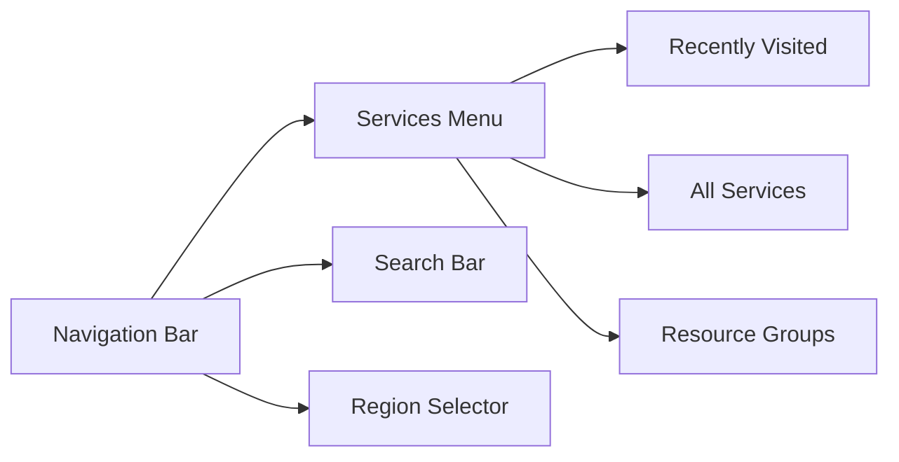
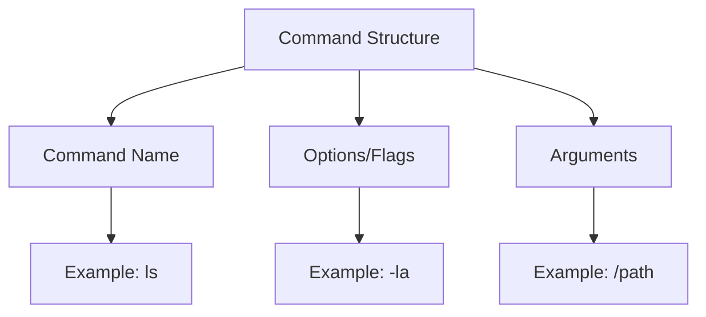
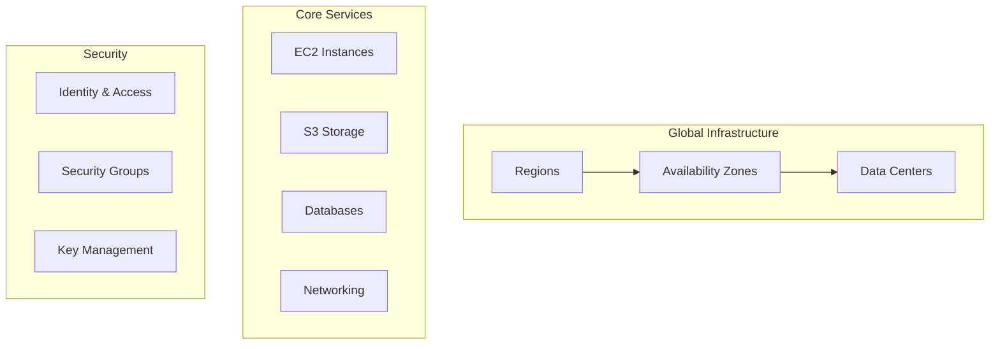
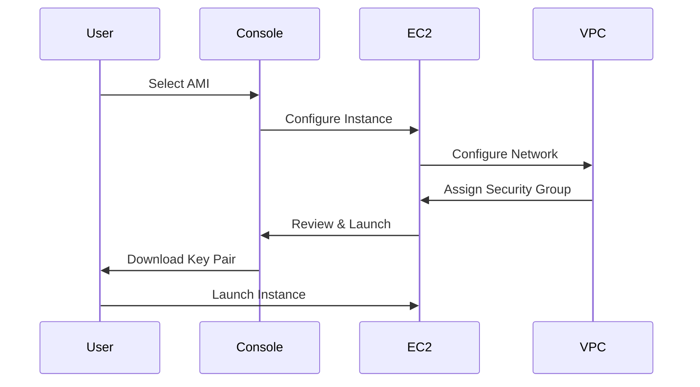
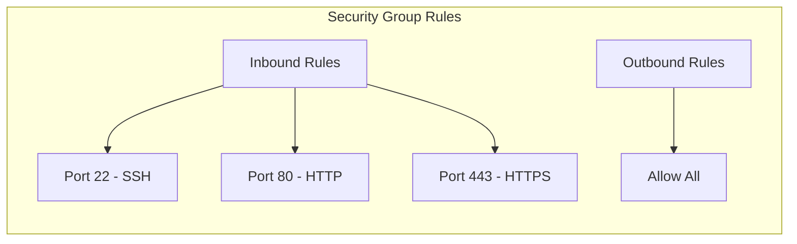
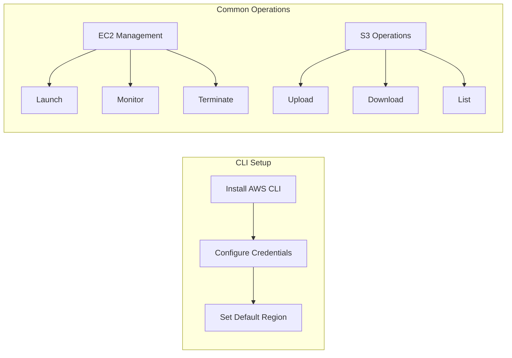
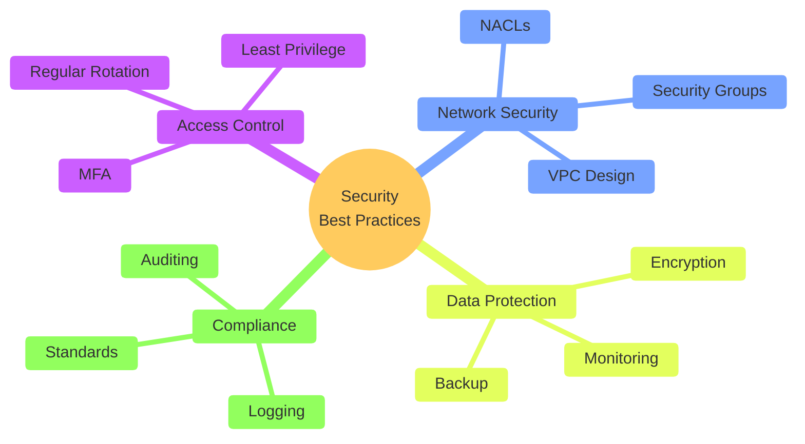
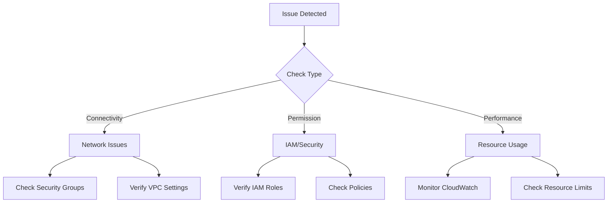
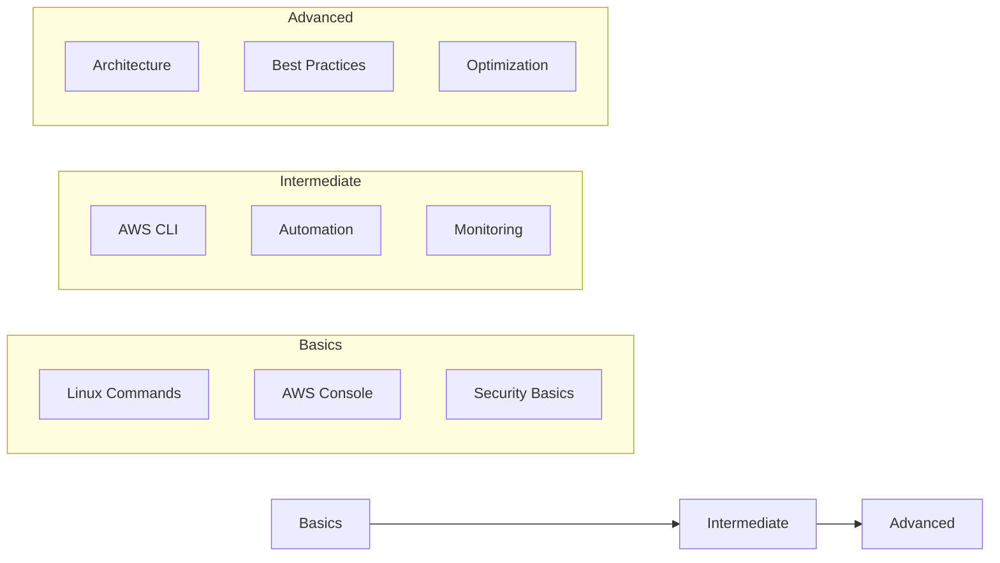

# Lecture 3: Essential Commands and AWS Platform Guide

## Navigation Map

```mermaid
mindmap
  root((AWS & Linux
    Essentials))
    Linux Fundamentals
      Basic Commands
      File Management
      Process Management
      Permissions
    AWS Console
      UI Navigation
      Services Overview
      IAM Setup
      Regions & AZ
    EC2 Management
      Instance Launch
      SSH Access
      Security Groups
      Key Management
    AWS CLI
      Installation
      Configuration
      Basic Commands
      Best Practices
    Docker Basics
      Container Ops
      Image Management
      Networking
      Volumes

# AWS Console Guide

## 1. AWS Management Console Overview

```mermaid
graph TB
    A[AWS Console Login] --> B[Service Selection]
    B --> C[Region Selection]
    B --> D[IAM & Security]
    B --> E[Resource Management]
    
    subgraph "Key Areas"
        C --> C1[Global vs Regional]
        C --> C2[Availability Zones]
        
        D --> D1[Users & Groups]
        D --> D2[Roles & Policies]
        
        E --> E1[EC2 Instances]
        E --> E2[Storage]
        E --> E3[Networking]
    end
```

### 1.1 Console Navigation



### 1.2 Essential UI Elements
1. **Top Navigation Bar**
   - Services dropdown
   - Search functionality
   - Region selector
   - Account information
   - Support center

2. **Service Dashboard**
   - Service overview
   - Quick access links
   - Resource summaries
   - Recent activities

## 2. Linux Command Structure



## 3. File System Hierarchy

```mermaid
graph TD
    root[/] --> bin[/bin]
    root --> etc[/etc]
    root --> home[/home]
    root --> usr[/usr]
    root --> var[/var]
    
    home --> user1[/user1]
    home --> user2[/user2]
    
    etc --> config[Configuration Files]
    var --> logs[System Logs]
```

## 4. AWS Service Architecture



## 5. EC2 Instance Management

### 5.1 Launch Process Flow



### 5.2 Security Group Configuration



## 6. AWS CLI Workflow



## 7. Essential Commands Reference

### 7.1 Linux File Operations
```bash
# Basic File Operations
ls -la                # List all files with details
pwd                   # Print working directory
cd /path/to/dir      # Change directory
mkdir -p dir/subdir  # Create directory structure
touch file.txt       # Create empty file
cp source dest       # Copy files
mv source dest       # Move/rename files
rm -rf dir           # Remove directory and contents
```

### 7.2 AWS CLI Essential Commands
```bash
# AWS CLI Configuration
aws configure                 # Set up AWS credentials
aws configure list           # View current configuration

# EC2 Operations
aws ec2 describe-instances   # List EC2 instances
aws ec2 start-instances     # Start EC2 instance
aws ec2 stop-instances      # Stop EC2 instance

# S3 Operations
aws s3 ls                    # List buckets
aws s3 cp file.txt s3://bucket/  # Upload file
aws s3 sync local/ s3://bucket/  # Sync directory
```

## 8. Best Practices and Security



## 9. Troubleshooting Guide



## 10. Further Resources

### 10.1 Learning Path



### 10.2 Documentation Links
- [AWS Documentation](https://docs.aws.amazon.com/)
- [Linux Command Library](https://linuxcommandlibrary.com/)
- [Docker Documentation](https://docs.docker.com/)

## Basic Linux Commands

### Directory Navigation and Management
```bash
# Directory Commands
pwd                     # Print working directory
cd /path/to/directory   # Change directory
cd ..                   # Go up one level
cd ~                    # Go to home directory
mkdir folder_name       # Create directory
mkdir -p path/to/folder # Create nested directories
rmdir folder_name       # Remove empty directory
rm -rf folder_name      # Remove directory and contents (use with caution!)

# File Creation and Manipulation
touch file.txt         # Create empty file
cp file1 file2        # Copy file
mv file1 file2        # Move/rename file
rm file.txt           # Remove file

# Viewing File Contents
cat file.txt          # Display entire file
less file.txt         # View file with pagination
head -n 10 file.txt   # View first 10 lines
tail -n 10 file.txt   # View last 10 lines
tail -f file.txt      # Follow file updates in real-time
```

### File Permissions
```bash
# Understanding Permissions
# rwx rwx rwx = user group others
# 421 421 421 = number values

# Changing Permissions
chmod 755 file.txt    # rwxr-xr-x
chmod u+x file.txt    # Add execute permission for user
chmod g+w file.txt    # Add write permission for group
chmod o-r file.txt    # Remove read permission for others

# Changing Ownership
chown user:group file.txt  # Change owner and group
```

## File Management

### Listing and Finding Files
```bash
# Listing Files
ls                    # List files in current directory
ls -l                 # Long format listing
ls -la               # Include hidden files
ls -lh               # Human-readable file sizes
ls -R                # Recursive listing

# Finding Files
find . -name "*.txt"  # Find all .txt files
find . -type d        # Find directories
find . -type f        # Find regular files
find . -mtime -7      # Files modified in last 7 days

# Searching File Contents
grep "pattern" file.txt     # Search in file
grep -r "pattern" .         # Recursive search
grep -i "pattern" file.txt  # Case-insensitive search
```

## Process Management

### Viewing Processes
```bash
# Process Commands
ps                    # Show current user processes
ps aux               # Show all processes
ps -ef               # Full format listing
top                  # Interactive process viewer
htop                 # Enhanced process viewer (if installed)

# Process Control
kill PID             # Terminate process by ID
kill -9 PID          # Force terminate process
killall process_name # Kill all processes by name
```

### System Monitoring
```bash
# System Resources
free -h              # Memory usage
df -h                # Disk usage
du -sh *            # Directory sizes
uptime              # System uptime
```

## AWS Setup and SSH Access

### Creating and Managing Key Pairs

1. **Through AWS Console:**
```bash
# Download .pem file from AWS Console
# Secure the key file
chmod 400 your-key.pem

# SSH using the key
ssh -i "your-key.pem" ec2-user@ec2-xx-xx-xx-xx.region.compute.amazonaws.com
```

2. **Using AWS CLI:**
```bash
# Create key pair
aws ec2 create-key-pair --key-name MyKeyPair --query 'KeyMaterial' --output text > MyKeyPair.pem

# List key pairs
aws ec2 describe-key-pairs

# Delete key pair
aws ec2 delete-key-pair --key-name MyKeyPair
```

### SSH Configuration Best Practices

1. **Create SSH Config File:**
```bash
# Edit ~/.ssh/config
vim ~/.ssh/config

# Add configuration
Host aws-dev
    HostName ec2-xx-xx-xx-xx.region.compute.amazonaws.com
    User ec2-user
    IdentityFile ~/.ssh/your-key.pem
    Port 22
```

2. **Multiple Keys Management:**
```bash
# Using SSH agent
eval $(ssh-agent)
ssh-add ~/.ssh/your-key.pem

# List added keys
ssh-add -l
```

### Alternative SSH Methods

1. **Using Session Manager (AWS Systems Manager):**
```bash
# Install Session Manager plugin
aws ssm start-session --target i-xxxxxxxxxxxxxxxxx

# Port forwarding
aws ssm start-session --target i-xxxxxxxxxxxxxxxxx \
    --document-name AWS-StartPortForwardingSession \
    --parameters "portNumber"=["22"],"localPortNumber"=["2222"]
```

2. **Using EC2 Instance Connect:**
```bash
aws ec2-instance-connect send-ssh-public-key \
    --instance-id i-xxxxxxxxxxxxxxxxx \
    --availability-zone us-west-2b \
    --instance-os-user ec2-user \
    --ssh-public-key file://key.pub
```

## Docker Basic Commands

### Container Management
```bash
# Images
docker images                 # List images
docker pull image_name       # Pull image
docker rmi image_name       # Remove image

# Containers
docker ps                    # List running containers
docker ps -a                # List all containers
docker run image_name       # Run container
docker start container_id   # Start container
docker stop container_id    # Stop container
docker rm container_id      # Remove container

# Container Access
docker exec -it container_id bash  # Access container shell
```

### Basic Docker Operations
```bash
# Building Images
docker build -t name:tag .          # Build from Dockerfile

# Network
docker network ls                    # List networks
docker network create network_name   # Create network

# Volumes
docker volume ls                     # List volumes
docker volume create volume_name     # Create volume
```

## Common AWS CLI Commands

### EC2 Management
```bash
# Instance Operations
aws ec2 run-instances --image-id ami-xxx --instance-type t2.micro --key-name MyKeyPair
aws ec2 describe-instances
aws ec2 start-instances --instance-ids i-xxx
aws ec2 stop-instances --instance-ids i-xxx
aws ec2 terminate-instances --instance-ids i-xxx

# Security Groups
aws ec2 describe-security-groups
aws ec2 authorize-security-group-ingress \
    --group-id sg-xxx \
    --protocol tcp \
    --port 22 \
    --cidr 0.0.0.0/0
```

### S3 Operations
```bash
# Bucket Operations
aws s3 ls
aws s3 mb s3://bucket-name
aws s3 rb s3://bucket-name

# File Operations
aws s3 cp file.txt s3://bucket-name/
aws s3 sync local-dir s3://bucket-name
```

## Best Practices

1. **Security**
   - Always use specific security group rules
   - Rotate access keys regularly
   - Use IAM roles instead of access keys when possible
   - Never share private keys

2. **SSH Access**
   - Use SSH config for easier management
   - Keep private keys secure (chmod 400)
   - Use bastion hosts for private instances
   - Enable SSH agent forwarding when needed

3. **Resource Management**
   - Tag resources appropriately
   - Monitor resource usage
   - Clean up unused resources
   - Use cost allocation tags

## Troubleshooting Guide

### Common SSH Issues
```bash
# Permission denied
chmod 400 your-key.pem

# Connection timed out
# Check security group rules
aws ec2 describe-security-groups --group-ids sg-xxx

# DNS resolution issues
ping ec2-xx-xx-xx-xx.region.compute.amazonaws.com
```

### AWS CLI Issues
```bash
# Configure AWS CLI
aws configure

# Check credentials
aws sts get-caller-identity

# Region issues
export AWS_DEFAULT_REGION=us-west-2
```

## Further Learning Resources

1. **AWS Documentation**
   - [AWS CLI Command Reference](https://docs.aws.amazon.com/cli/latest/reference/)
   - [EC2 User Guide](https://docs.aws.amazon.com/AWSEC2/latest/UserGuide/)
   - [AWS Systems Manager User Guide](https://docs.aws.amazon.com/systems-manager/latest/userguide/)

2. **Linux Commands**
   - [Linux Documentation Project](https://tldp.org/)
   - [Linux Command Library](https://linuxcommandlibrary.com/)

3. **Docker Documentation**
   - [Docker Get Started](https://docs.docker.com/get-started/)
   - [Docker Command Reference](https://docs.docker.com/engine/reference/commandline/cli/)