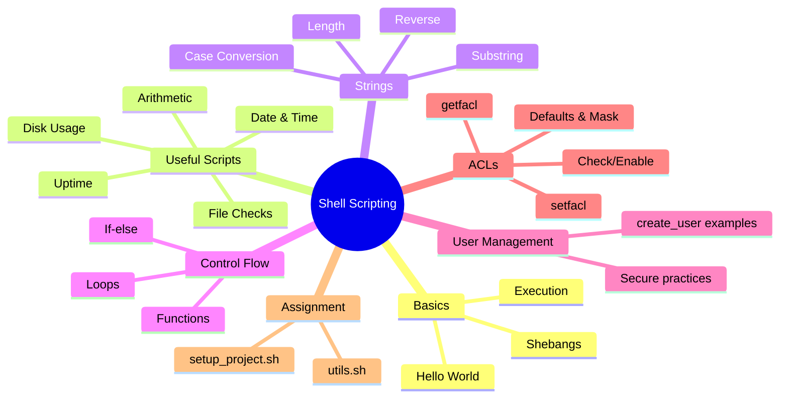

# Lecture 4: Shell Scripting — Practical Notes and Exercises

## Navigation map



## Short intro
This lecture gives practical, copy-pasteable shell scripting notes. Each example includes:
- a small script (with a filename suggestion),
- an explanation of what it does, and
- any important notes about portability or permissions.

Files in examples assume Bash (`#!/bin/bash`) unless explicitly noted.

---

## 1. Hello World
File: `hello_world.sh`

```bash
#!/bin/bash
# This is a simple shell script that prints "Hello, World!" to the terminal
echo "Hello, World!"
```

Explanation:
- `#!/bin/bash` is the shebang telling the OS to use Bash to run this file.
- `echo` prints text to stdout.

Run:
```bash
chmod +x hello_world.sh
./hello_world.sh
```

---

## 2. Shebangs (what to choose and why)
- `#!/bin/bash` — Use this when you need Bash-specific features (arrays, `${var^^}`, `[[ ]]`).
- `#!/bin/sh` — POSIX shell; very portable, smaller feature set.
- `#!/usr/bin/env bash` — More portable across systems where `bash` isn't in `/bin`.
- `#!/bin/zsh`, `#!/usr/bin/python3`, etc. — Choose according to interpreter.

Table: quick comparison

| Shebang | Interpreter | Use case |
|---|---:|---|
| `#!/bin/bash` | Bash | Feature-rich scripts on Linux distros where Bash is available |
| `#!/bin/sh` | POSIX shell | Maximum portability and simplicity |
| `#!/usr/bin/env bash` | env wrapper | Portable when location of bash varies |

Bash-only examples that will fail under `/bin/sh`:
- `${var^^}` (case conversion)
- Arrays: `arr=(a b c)`
- `[[ ... ]]` conditional tests

---

## 3. Useful small scripts (copy, run, learn)
Each snippet below is a complete script. Make executable with `chmod +x <file>` and run `./<file>`.

### Current date and time — `current_time.sh`
```bash
#!/bin/bash
# Prints current date and time
echo "Current date and time: $(date)"
```

### Check disk usage — `disk_usage.sh`
```bash
#!/bin/bash
# Human-readable disk usage summary
echo "Disk usage report:"
df -h
```

### List files in directory — `list_files.sh`
```bash
#!/bin/bash
echo "Files in current directory:"
ls -l
```

### Check if a file exists — `file_check.sh`
```bash
#!/bin/bash
read -p "Enter filename: " file
if [ -f "${file}" ]; then
  echo "File '${file}' exists."
else
  echo "File '${file}' does not exist."
fi
```

Explanation:
- `-f` tests for a regular file. Other useful tests: `-d` (directory), `-e` (exists).

### Add two numbers — `add_numbers.sh`
```bash
#!/bin/bash
read -p "Enter first number: " a
read -p "Enter second number: " b
sum=$((a + b))
echo "Sum: $sum"
```

Notes: arithmetic uses `$(( ... ))`.

### System uptime — `system_uptime.sh`
```bash
#!/bin/bash
# Pretty uptime
echo "System has been up for:"
uptime -p
```

### Check if user exists — `check_user.sh`
```bash
#!/bin/bash
read -p "Enter username to check: " user
if id "${user}" &>/dev/null; then
  echo "User '${user}' exists."
else
  echo "User '${user}' not found."
fi
```

### Backup a directory — `backup_dir.sh`
```bash
#!/bin/bash
read -p "Enter source directory: " src
read -p "Enter backup directory: " dest
mkdir -p "${dest}"
archive_name="backup_$(date +%F).tar.gz"
tar -czf "${dest}/${archive_name}" -C "$(dirname "${src}")" "$(basename "${src}")"
echo "Backup completed: ${dest}/${archive_name}"
```

Notes: `tar -C` changes to directory before archiving so the archive has the expected structure.

### Check internet connectivity — `check_internet.sh`
```bash
#!/bin/bash
if ping -c 1 8.8.8.8 &>/dev/null; then
  echo "Internet is working."
else
  echo "No internet connection."
fi
```

---

## 4. String operations (Bash 4+ features)

### Length of a string — `string_length.sh`
```bash
#!/bin/bash
read -p "Enter a string: " str
echo "Length of string: ${#str}"
```

### Case conversion — `uppercase.sh` / `lowercase.sh`
```bash
#!/bin/bash
read -p "Enter a string: " str
# Uppercase
echo "Uppercase: ${str^^}"
# Lowercase
# echo "Lowercase: ${str,,}"
```

Note: `${var^^}` requires Bash 4+. Alpine images often have older shells; use `#!/usr/bin/env bash` or install bash.

### Reverse a string — `reverse_string.sh`
```bash
#!/bin/bash
read -p "Enter a string: " str
rev_str=$(echo "${str}" | rev)
echo "Reversed string: ${rev_str}"
```

### Compare two strings — `compare_strings.sh`
```bash
#!/bin/bash
read -p "Enter first string: " str1
read -p "Enter second string: " str2
if [[ "${str1}" == "${str2}" ]]; then
  echo "Strings are equal."
else
  echo "Strings are not equal."
fi
```

Note: `[[ ... ]]` is Bash-specific. To be POSIX-compatible use `[ "${str1}" = "${str2}" ]`.

### Extract substring — `substring_extract.sh`
```bash
#!/bin/bash
read -p "Enter a string: " str
read -p "Enter starting position (0-based): " pos
read -p "Enter length: " len
echo "Substring: ${str:${pos}:${len}}"
```

---

## 5. /bin/sh vs /bin/bash — Practical guide

- `/bin/sh` is for portable, POSIX-compliant scripts.
- `/bin/bash` gives you powerful built-ins and convenience.

Examples that fail with `/bin/sh`:
- `${var^^}` — case conversion
- Arrays `arr=(a b c)`
- `[[ ... ]]` conditional expressions

Practical guideline:
- Use `/bin/sh` for simple init scripts, Docker ENTRYPOINTs when portability matters.
- Use `/bin/bash` for interactive scripts or when you need features like arrays and extended string ops.

---

## 6. User management scripts

### Minimal (non-standards) — `create_user_quick.sh`
```bash
#!/bin/bash
USERNAME="$1"
GROUPNAME="$2"

groupadd "${GROUPNAME}"
useradd -m -s /bin/bash -g "${GROUPNAME}" "${USERNAME}"
# Add welcome message to .bashrc
echo "echo \"Welcome, ${USERNAME}!!\"" >> /home/${USERNAME}/.bashrc

echo "Setup complete for ${USERNAME}."
```

Warning: This quick version doesn't check for errors or existing users.

### Robust script (standards) — `create_user.sh`
```bash
#!/bin/bash
# ===============================================
# Script Name: create_user.sh
# Description: Create a new Linux user and group,
# set home directory and shell.
# Usage: sudo ./create_user.sh <username> <groupname>
# ===============================================
set -euo pipefail

if [[ ${EUID} -ne 0 ]]; then
  echo "This script must be run as root (use sudo)"
  exit 1
fi

if [[ $# -ne 2 ]]; then
  echo "Usage: $0 <username> <groupname>"
  exit 1
fi

USERNAME="$1"
GROUPNAME="$2"

if getent group "${GROUPNAME}" > /dev/null; then
  echo "Group '${GROUPNAME}' already exists."
else
  echo "Creating group '${GROUPNAME}'..."
  groupadd "${GROUPNAME}"
fi

if id "${USERNAME}" &>/dev/null; then
  echo "User '${USERNAME}' already exists."
else
  echo "Creating user '${USERNAME}'..."
  useradd -m -s /bin/bash -g "${GROUPNAME}" "${USERNAME}"
  echo "User '${USERNAME}' created with home /home/${USERNAME}"
fi

read -p "Do you want to set a password for ${USERNAME}? (y/n): " choice
if [[ "${choice}" == "y" || "${choice}" == "Y" ]]; then
  passwd "${USERNAME}"
fi

echo "User setup completed successfully!"
```

Notes:
- `set -euo pipefail` makes the script fail fast and safer.
- `getent group` and `id` used to check existence.

---

## 7. Assignment (reusable utils + main script)
Objective: create a reusable `utils.sh` and a `setup_project.sh` that creates timestamped directories.

### `utils.sh`
```bash
#!/bin/bash
# utils.sh — Utility functions for project setup
# Function to create a timestamped directory
create_timestamped_dir() {
  local project_name="$1"
  if [ -z "${project_name}" ]; then
    echo "Error: Project name not provided." >&2
    return 1
  fi
  local timestamp
  timestamp=$(date +%Y%m%d-%H%M%S)
  local dir_path="/tmp/${project_name}-${timestamp}"
  mkdir -p "${dir_path}"
  echo "${dir_path}"
}
```

### `setup_project.sh`
```bash
#!/bin/bash
# setup_project.sh — Main script to set up a new project
set -euo pipefail
# Source utility functions from same directory
source "$(dirname "$0")/utils.sh"

# Create directory for project name 'my-new-app'
created=$(create_timestamped_dir "my-new-app")

echo "Created project directory: ${created}"
```

Usage:
```bash
chmod +x utils.sh setup_project.sh
./setup_project.sh
```

Notes:
- `source "$(dirname "$0")/utils.sh"` keeps sourcing robust even when the script is executed from another directory.
- `create_timestamped_dir` prints the created path so callers can capture it.

---

## 8. ACLs (Access Control Lists)

ACLs allow fine-grained permissions beyond basic owner/group/other. Useful for sharing a directory with multiple users.

### Check if ACL support is enabled
```bash
mount | grep acl || true
```
If not present, add `acl` to mount options in `/etc/fstab` or remount:
```bash
sudo mount -o remount,acl /home
```

### View ACLs
```bash
getfacl filename_or_dir
```
Example output explanation:
```
# file: project.txt
# owner: root
# group: root
user::rw-
user:john:r--
group::r--
mask::r--
other::---
```
- `user::` = owner permissions
- `user:john:` = specific user entry
- `mask::` = maximum allowed for non-owner entries

### Set ACLs
- Give a user read access:
```bash
setfacl -m u:john:r-- project.txt
```
- Give a group read/write:
```bash
setfacl -m g:developers:rw- project.txt
```
- Set default ACLs for a directory (applies to new files):
```bash
setfacl -d -m u:john:rwX /var/www/
```
- Recursive setting:
```bash
setfacl -R -m u:john:rwX /var/www/
```

### Remove ACL entries
```bash
setfacl -x u:john project.txt   # remove john entry
setfacl -b project.txt           # remove all ACL entries
```

### Mask explanation
- The `mask` limits permissions for all named users and groups (not the owner).
- To set the mask to rw-:
```bash
setfacl -m m::rw- project.txt
```

### Script: give team access — `set_team_acl.sh`
```bash
#!/bin/bash
SHARE_DIR="/data/team"
USER_LIST="alice bob charlie"
for user in ${USER_LIST}; do
  setfacl -m u:${user}:rwx "${SHARE_DIR}"
done
```
Run as root or with sudo.

---

## 9. Practical tips & best practices
- Always add `set -euo pipefail` for robust scripts unless interactive behavior is required.
- Quote variables: use `"${var}"` to avoid word-splitting and globbing issues.
- Check return codes and handle errors clearly.
- For portability, use POSIX constructs when required. For convenience, prefer Bash and declare it.
- Use `shellcheck` to lint scripts.
- Keep scripts small and testable; prefer functions and a `--help` flag for complex tools.

---

## 10. Quick reference cheat-sheet
- `chmod +x file` — make executable
- `./script.sh` — run script in current dir
- `bash script.sh` — run with bash explicitly
- `source file` or `. file` — import functions/vars into current shell
- `set -euo pipefail` — fail fast and safe
- `$(command)` — command substitution
- `${var}` — parameter expansion

---

## 11. Assignment recap and validation
- Implement `utils.sh` and `setup_project.sh` exactly as above.
- Validate by running `./setup_project.sh` and verifying that `/tmp/my-new-app-<timestamp>` exists.
- Bonus: modify `setup_project.sh` to accept project name as an argument and validate input.

Example bonus change (in `setup_project.sh`):
```bash
PROJECT_NAME="${1:-my-new-app}"
created=$(create_timestamped_dir "${PROJECT_NAME}")
```

---

## 12. Further reading and tools
- shellcheck (https://www.shellcheck.net/) — static analysis
- Bash Reference Manual — http://www.gnu.org/software/bash/manual/
- Advanced Bash-Scripting Guide — https://tldp.org/LDP/abs/html/

---

End of Lecture 4. Happy scripting!
