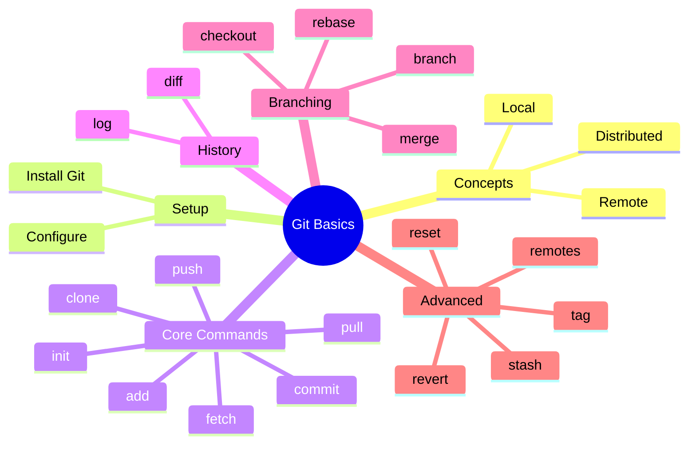
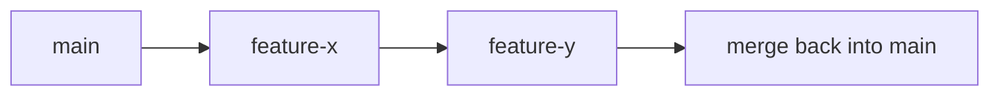

# Lecture 5: Git Basics — Local, Remote, and Distributed Repositories

## Quick map



## 1. Local vs Remote vs Distributed

- **Local repository**: the `.git` directory in your project on your machine. You can commit changes locally without network access.
- **Remote repository**: a shared repository (e.g., GitHub, GitLab) accessible over network. Common remote names: `origin`.
- **Distributed model**: Every clone contains full history — no single central server is required, but teams typically use remotes for collaboration.

```mermaid
graph LR
    Local1[Developer A Local Repo] -->|push/pull| Remote[Central Remote Repo (origin)]
    Local2[Developer B Local Repo] -->|push/pull| Remote
    Local3[Developer C Local Repo] -->|push/pull| Remote
```

## 2. Install Git

macOS (Homebrew):

```bash
brew install git
```

Ubuntu/Debian:

```bash
sudo apt update
sudo apt install git -y
```

Windows:

- Install Git for Windows: https://git-scm.com/download/win

Verify:

```bash
git --version
```

## 3. Configure Git (one-time)

```bash
git config --global user.name "Your Name"
git config --global user.email "you@example.com"
# Helpful defaults
git config --global core.editor "code --wait"
git config --global init.defaultBranch main

# Check config
git config --list
```

## 4. Initialize a Local Repository

```bash
mkdir myproject
cd myproject
git init
# creates .git directory and initializes an empty repo
```

Diagram:

```mermaid
graph LR
    Workspace --> Index[Staging Area (index)]
    Index --> Repository[.git (local repo)]
    Repository --> Remote[origin]
```

## 5. Clone Remote Repository

```bash
git clone git@github.com:owner/repo.git
# or https
git clone https://github.com/owner/repo.git
```

Cloning creates a working copy and sets `origin` remote automatically.

## 6. Staging & Committing

Workflow:
1. Edit files in working directory
2. Stage changes with `git add`
3. Commit staged changes with `git commit`

```bash
# Stage a single file
git add file.txt

# Stage all changes (tracked files and new files)
git add -A

# Commit with message
git commit -m "Add new feature"

# Commit with staged changes and open editor
git commit
```

Notes:
- Staging gives you fine-grained control.
- Use small, focused commits with good messages.

## 7. Viewing History

```bash
git log

# Pretty one-line log
git log --oneline --graph --decorate --all

# Limit number of commits
git log -n 5
```

## 8. Inspecting Changes

```bash
git status       # Shows changed files and staging
git diff         # Show unstaged changes
git diff --staged # Show staged changes
```

## 9. Push and Pull

```bash
# Push local branch to origin
git push origin main

# Fetch new refs from origin and merge
git pull origin main

# Fetch only (no merge)
git fetch origin
```

## 10. Branching and Merging

Create a branch:

```bash
git branch feature-x
# or create and switch
git checkout -b feature-x
```

Switch branches:

```bash
git checkout main
# or newer syntax
git switch main

git switch -c feature-y  # create+switch
```

Merge a branch into main:

```bash
git checkout main
git merge feature-x
```

Rebase (alternate to merge):

```bash
git checkout feature-x
git rebase main
```

Diagram:



## 11. Important Additional Commands

- `git stash` — save working changes temporarily
- `git stash pop` — reapply stash
- `git reset --soft|--mixed|--hard` — move branch pointer and optionally reset index/worktree
- `git revert <commit>` — create a new commit that undoes a commit (safe for public history)
- `git rm` — remove files from worktree and index
- `git mv` — move/rename files (tracks rename in history)
- `git tag` — add tags for releases (`git tag -a v1.0 -m "Release v1.0"`)
- `git remote -v` — list remotes
- `git remote add origin <url>` — add remote
- `git shortlog -s` — show contributor summary
- `git blame file` — show per-line commit info

## 12. Example workflows

A. Basic local -> remote push

```bash
# create repo
git init
# add files
git add .
# commit
git commit -m "initial commit"
# add remote
git remote add origin git@github.com:me/repo.git
# push
git push -u origin main
```

B. Feature branch workflow

```bash
# start from main
git checkout -b feature-x
# work
git add .
git commit -m "WIP: feature x"
# update main
git checkout main
git pull origin main
# rebase feature on latest main
git checkout feature-x
git rebase main
# push feature
git push -u origin feature-x
# open PR on platform (GitHub/GitLab)
```

C. Undo mistakes

```bash
# soft reset (keep changes staged)
git reset --soft HEAD~1

# discard unstaged changes (warning: destructive)
git checkout -- file.txt

# completely reset to origin/main (destructive)
git fetch origin
git reset --hard origin/main
```

## 13. Best practices

- Commit often with small changes
- Write meaningful commit messages (subject + body)
- Use feature branches and pull/merge requests
- Keep `main` stable and deployable
- Use tags for releases
- Protect important branches with required reviews/CI

## 14. Troubleshooting tips

- `git fsck` — check repository integrity
- `git reflog` — recover lost commits
- `git cherry-pick` — pick specific commits

## 15. Quick cheat sheet

- Init: `git init`
- Clone: `git clone <url>`
- Stage: `git add <file>`
- Commit: `git commit -m "msg"`
- Push: `git push origin <branch>`
- Pull: `git pull origin <branch>`
- Branch: `git branch`, `git checkout -b <name>`
- Diff: `git diff`
- Log: `git log --oneline --graph --decorate --all`
- Reset: `git reset --hard <commit>`

---

End of Lecture 5: Git Basics
