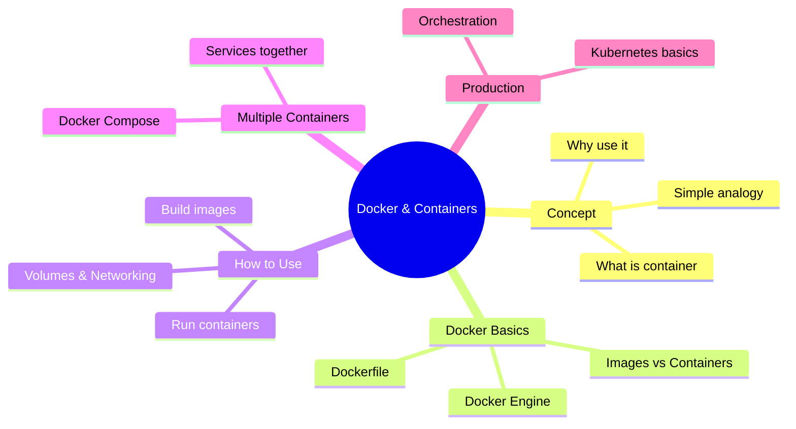

# Lecture 6: Introduction to Containerization & Docker

## Quick overview



---

## 1. What is containerization? (Simple)

Containerization packages your application and everything it needs (code, libraries, settings) into a single unit that works anywhere.

### Real-world analogy:

**Shipping container (physical)**
- Same box works on ships, trains, trucks
- Contents protected and isolated
- Standard size, easy to stack

**Docker container (software)**
- Same container works on laptop, server, cloud
- App protected and isolated
- Standard format, easy to run

### Why is this useful?

- **Consistency**: App runs the same everywhere
- **No surprises**: "Works on my machine" problem is solved
- **Portable**: Move between laptop and cloud easily
- **Efficient**: Multiple containers on one machine

---

## 2. What is Docker? (Simply)

Docker is the most popular tool for containerization. It makes building, packaging, and running containers easy.

### Docker in one picture:

```
You write code → Dockerfile → docker build → Image → docker run → Container
                (recipe)       (cook it)    (package) (start it) (running app)
```

### Key parts of Docker:

| Part | What it is | Like... |
|------|-----------|---------|
| **Image** | Blueprint/template (doesn't change) | A class in programming |
| **Container** | Running instance of image | An object/instance |
| **Dockerfile** | Instructions to build image | A recipe for cooking |
| **Docker Engine** | Software that runs containers | A kitchen that cooks |
| **Registry (Hub)** | Online storage for images | GitHub for containers |

---

## 3. Why do you need Docker?

### Problem without Docker:

You build an app on your Mac with:
- Node.js v18
- PostgreSQL v14
Docker CLI (command tool)
## 5. Images vs Containers (Most Important!)
    Image --> C3["🚀 Container 3<br/>(running myapp)"]

docker --version
docker build -t myapp:1.0 .
docker images
docker run -it --name my-shell ubuntu:22.04 bash
docker run -d --name web -p 8080:80 nginx:alpine
docker ps
docker ps -a

docker rm myapp
docker rmi myapp:1.0
docker logs -f myapp
docker exec -it myapp bash
Build and run:


# Create volume

# Create network
docker network create mynet
Run:
 # Lecture 6 — Docker Introduction (clear guide & quick start)

This lecture gives a concise, practical introduction to containerization with Docker. It focuses on concepts you need to get started, quick commands, a minimal hands-on lab, and recommended next steps.

## What you'll learn

- What containers are and why they matter
- What Docker provides (engine, CLI, images, registries)
- A minimal install & quick-start example (build → run)
- Key Docker commands and a cheat-sheet
- Short notes on networking, storage, Compose and security

---

## 1 — Containers in one sentence

Containers package an application and its dependencies so the app runs reliably across environments. They are lightweight, start fast, and share the host kernel.

```mermaid
graph LR
  Host[Host machine (kernel)] --> Docker[Docker Engine]
  Docker --> IMG[Image: myapp:1.0]
  IMG --> CNT[Container: myapp-instance]
  CNT --> Process[App process]
```

Key property: containers are processes with isolated resources (not full VMs).

---

## 2 — Why Docker? (short)

- Reproducible environments (dev ⇄ prod)
- Faster development iteration (start/stop in seconds)
- Easier CI/CD and deployment (immutable artifacts)
- Efficient resource usage vs full VMs

---

## 3 — Docker components (brief)

- Docker Engine (daemon `dockerd`) — manages containers
- Docker CLI (`docker`) — user tool
- Images — read-only templates built from Dockerfile
- Containers — running instances of images
- Registry — image storage (Docker Hub, ECR, GCR, private)

---

## 4 — Install (quick commands)

macOS (Docker Desktop):

```bash
# Install via Homebrew Cask
brew install --cask docker
```

Ubuntu (Docker Engine):

```bash
sudo apt-get update
sudo apt-get install -y ca-certificates curl gnupg lsb-release
curl -fsSL https://download.docker.com/linux/ubuntu/gpg | sudo gpg --dearmor -o /usr/share/keyrings/docker.gpg
echo \
  "deb [arch=$(dpkg --print-architecture) signed-by=/usr/share/keyrings/docker.gpg] https://download.docker.com/linux/ubuntu $(lsb_release -cs) stable" \
  | sudo tee /etc/apt/sources.list.d/docker.list > /dev/null
sudo apt-get update
sudo apt-get install -y docker-ce docker-ce-cli containerd.io docker-compose-plugin

# Optional: allow your user to run docker without sudo
sudo usermod -aG docker $USER
```

Verify:

```bash
docker --version
docker compose version
docker run --rm hello-world
```

---

## 5 — Minimal hands-on lab (5 minutes)

Purpose: build an image from a tiny app and run it locally.

1) Create a folder `demo` and a file `index.html`:

```bash
mkdir demo && cd demo
echo "<h1>Hello from Docker</h1>" > index.html
```

2) Create a minimal `Dockerfile`:

```Dockerfile
FROM nginx:alpine
COPY index.html /usr/share/nginx/html/index.html
```

3) Build and run:

```bash
docker build -t hello-nginx:1.0 .
docker run -d --name hello -p 8080:80 hello-nginx:1.0
# Open http://localhost:8080
```

4) Stop and remove:

```bash
docker stop hello && docker rm hello
docker image rm hello-nginx:1.0
```

This lab demonstrates image → container lifecycle.

---

## 6 — Quick command cheat-sheet

Basic:

```bash
docker build -t NAME:TAG .       # build image from Dockerfile
docker run -d --name NAME -p HOST:CONTAINER IMAGE  # run detached
docker ps                        # list running containers
docker ps -a                     # list all containers
docker logs -f NAME              # follow logs
docker exec -it NAME sh          # open shell inside container
docker stop NAME                 # stop
docker rm NAME                   # remove container
docker rmi IMAGE                 # remove image
```

Images & registry:

```bash
docker images
docker pull IMAGE
docker push IMAGE
docker tag SOURCE TARGET
```

Compose (multi-container):

```bash
docker compose up -d
docker compose down
```

System cleanup:

```bash
docker system df                 # disk usage
docker image prune -a            # remove unused images
docker container prune           # remove stopped containers
```

---

## 7 — Short notes (networking, storage, orchestration)

- Networking: containers use bridge networks by default; use `--network` or Docker Compose for service communication.
- Storage: containers are ephemeral — use volumes for persistence (`-v host:container` or named volumes).
- Orchestration: for production use Kubernetes or Docker Swarm to schedule and scale containers.

---

## 8 — Security & best practices (short)

- Do not run processes as root inside containers. Use `USER` in Dockerfile.
- Keep images small (use `alpine` or multi-stage builds).
- Pin base image versions for reproducible builds.
- Scan images for vulnerabilities (Trivy, Docker scan).
- Use signed/private registries for sensitive artifacts.

---

## 9 — Where to go next (recommended)

1. Read Lecture 7 (Images internals) and 8 (Dockerfile patterns).
2. Try the hands-on lab, then replace Nginx with a tiny Node/Go app.
3. Add a `docker-compose.yml` with a web + redis stack.
4. Explore `docker inspect` and `docker history` on your built image.

---

End of Lecture 6 — concise Docker introduction
---

End of Lecture 6: Docker Introduction
