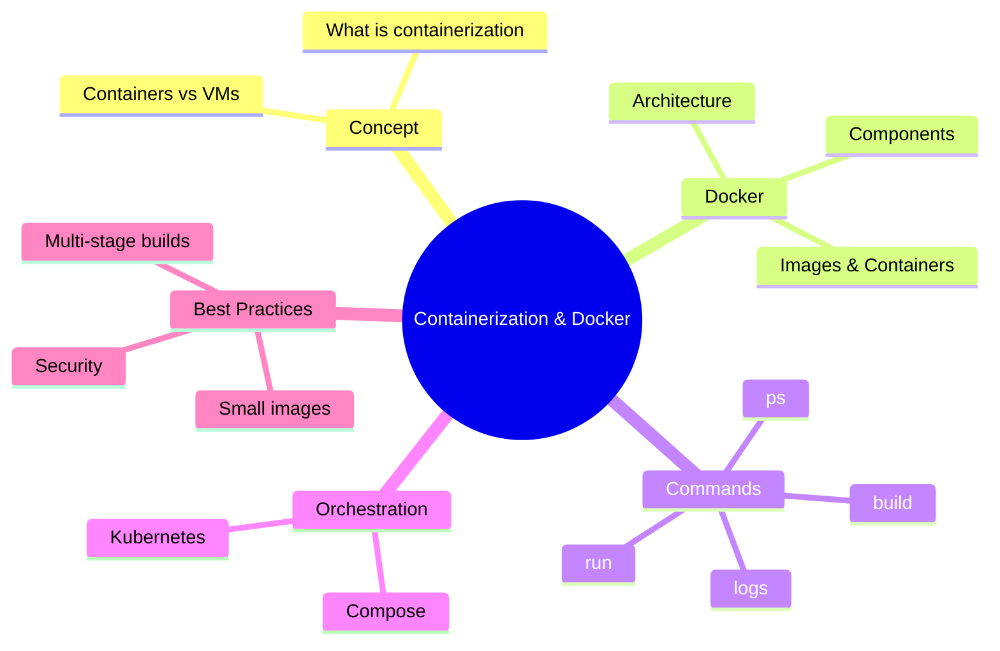
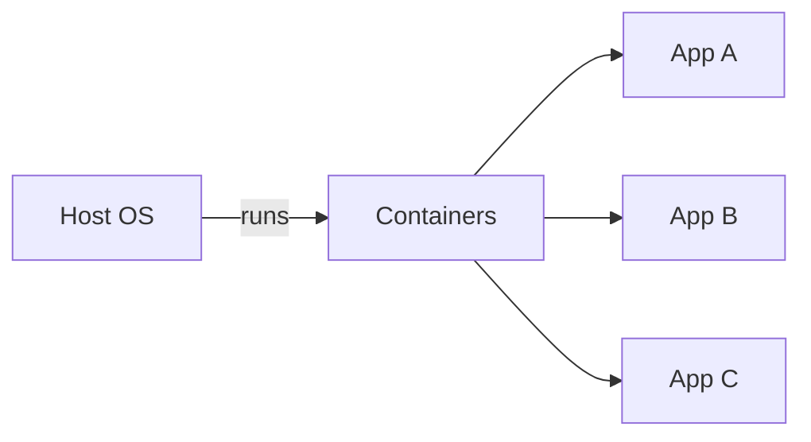
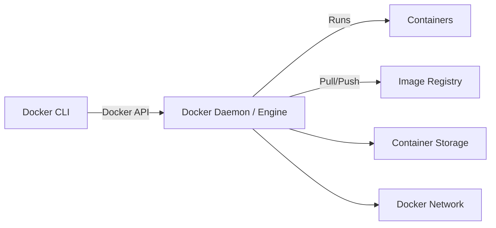
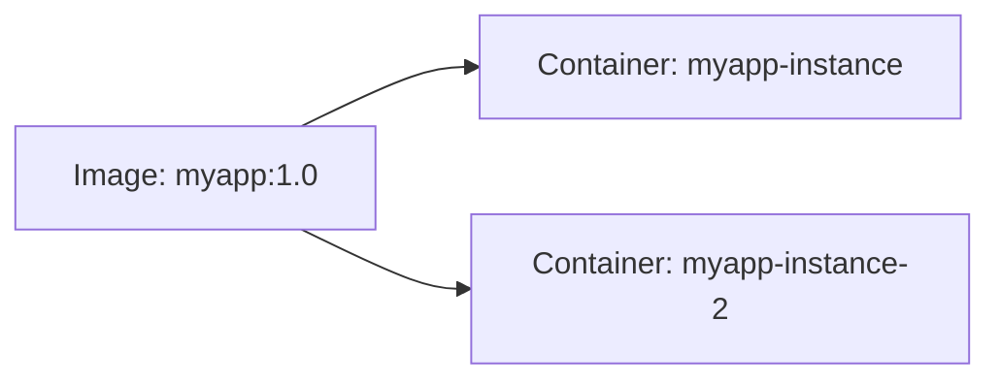

# Lecture 6: Introduction to Containerization & Docker

## Navigation map



## 1. What is containerization?

Containerization is a lightweight form of virtualization that packages an application and its dependencies together so it can run reliably across different computing environments. Containers share the host OS kernel but keep application files, libraries, and runtime isolated.

Advantages:
- Portability: "it runs the same locally and in production"
- Consistency: packaged dependencies avoid "works on my machine" issues
- Fast startup: containers start in seconds
- Density: more containers can run on a host than full VMs



## 2. What is Docker?

Docker is the most popular container platform. It provides tooling and a runtime to build, ship, and run containers.
Key Docker components:
- Docker Engine (daemon) — runs on the host and manages containers
- Docker CLI — user tool to build/run/manage containers
- Images — read-only templates used to create containers
- Containers — runtime instances of images
- Dockerfile — recipe that defines how to build an image
- Registry (Docker Hub, private registries) — stores images

## 3. Why do you need Docker?

- Reproducible environments for development, testing, and production
- Simplifies dependency management and deployment
- Enables microservices architecture by packaging each service into its own container
- Easier CI/CD pipelines and immutable deployments
- Better resource efficiency than full VMs

## 4. Docker Architecture



- Docker CLI talks to the Docker Daemon (dockerd) via REST API or socket.
- Daemon manages images, volumes, networks, and containers.
- Registries hold images; `docker pull` downloads images and `docker push` uploads them.

## 5. Images vs Containers

- **Image**: immutable, read-only filesystem and metadata (like a class)
- **Container**: writable instance of an image with its own process space (like an object)



## 6. Basic Docker Workflow & Commands

1. Write a `Dockerfile`
2. Build image: `docker build -t myapp:1.0 .`
3. Run container: `docker run --name myapp -p 8080:80 myapp:1.0`
4. Push to registry: `docker push myregistry/myapp:1.0`

Common commands (examples):

```bash
# Show Docker version
docker --version

# Build image from Dockerfile
docker build -t myapp:1.0 .

# List images
docker images

# Run a container interactively
docker run -it --name my-shell ubuntu:22.04 bash

# Run detached with port mapping
docker run -d --name web -p 8080:80 nginx:alpine

# List running containers
docker ps

# List all containers
docker ps -a

# Stop & remove container
docker stop myapp
docker rm myapp

# Remove image
docker rmi myapp:1.0

# View logs
docker logs -f myapp

# Execute command in running container
docker exec -it myapp bash

# Copy files to container
docker cp ./config.json myapp:/app/config.json
```

### Example Dockerfile (simple web app)

```Dockerfile
# Use lightweight base image
FROM node:18-alpine

# Create app directory
WORKDIR /app

# Copy package manifests and install dependencies first (cache deps)
COPY package*.json ./
RUN npm ci --only=production

# Copy app source
COPY . .

# Expose port and start
EXPOSE 3000
CMD ["node", "index.js"]
```

Build and run:

```bash
docker build -t my-node-app:1.0 .
docker run -d --name my-node -p 3000:3000 my-node-app:1.0
```

## 7. Networking, Volumes, and Persistency

- Containers are ephemeral; use **volumes** for persistent data.

```bash
# Create volume
docker volume create data-vol
# Run container with volume
docker run -d -v data-vol:/var/lib/data mydb:latest
```

- Docker networks (bridge by default) allow containers to communicate.

```bash
# Create network
docker network create mynet
# Run containers in same network
docker run -d --network mynet --name app1 myapp
docker run -d --network mynet --name app2 myapp
```

## 8. Docker Compose (multi-container apps)

`docker-compose.yml` example:

```yaml
version: '3.8'
services:
  web:
    build: ./web
    ports:
      - "8080:80"
    depends_on:
      - api
  api:
    build: ./api
    ports:
      - "3000:3000"
    volumes:
      - api-data:/data
volumes:
  api-data:
```

Run:

```bash
docker compose up -d
```

Compose simplifies running multiple containers, wiring networks, and volumes locally and in CI.

## 9. Orchestration (brief)

- For production at scale, use orchestration platforms like **Kubernetes** or Docker Swarm.
- Kubernetes schedules containers (pods) across nodes, provides service discovery, autoscaling, rolling updates, and more.

## 10. Comparison: Containers vs Virtual Machines

| Feature | Virtual Machine | Container |
|---|---:|---:|
| Guest OS | Full guest OS per VM | Share host kernel |
| Size | Large (GBs) | Small (MBs–hundreds MBs)
| Boot time | Minutes | Seconds
| Density | Fewer VMs per host | Many containers per host
| Isolation | Strong (hardware virtualization) | Process-level isolation

## 11. Best practices

- Use small base images (alpine, distroless) when possible
- Use multi-stage builds to reduce final image size
- Pin base image versions (`node:18-alpine` → `node:18.17.1-alpine`)
- Avoid running processes as root inside container
- Add `.dockerignore` to exclude build artifacts
- Keep container ephemeral; store state in volumes or external services
- Scan images for vulnerabilities (Trivy, Clair)
- Use immutable tags for releases and `latest` for development only

## 12. Security considerations

- Run least-privileged containers (non-root user)
- Use user namespaces if supported
- Limit container capabilities
- Apply resource limits (CPU, memory)
- Use signed images and private registries for sensitive code

## 13. Quick commands cheat-sheet

- Build: `docker build -t name:tag .`
- Run: `docker run -d --name name -p host:container name:tag`
- List running containers: `docker ps`
- Remove stopped containers: `docker container prune`
- List images: `docker images`
- Remove dangling images: `docker image prune`
- Compose up: `docker compose up -d`
- Compose down: `docker compose down`

## 14. Hands-on suggestions (practice tasks)

1. Build the example Dockerfile above and run the app locally.
2. Create a `docker-compose.yml` for a simple web + redis stack.
3. Convert a multi-stage build to reduce image size for a Go or Node app.
4. Use `trivy` to scan your built image for vulnerabilities.

---

End of Lecture 6: Docker Introduction
