# Lecture 6: Introduction to Containerization & Docker

## Quick overview


---

## 1. What is containerization? (Simple)

Containerization packages your application and everything it needs (code, libraries, settings) into a single unit that works anywhere.

### Real-world analogy:

**Shipping container (physical)**
- Same box works on ships, trains, trucks
- Contents protected and isolated
- Standard size, easy to stack

**Docker container (software)**
- Same container works on laptop, server, cloud
- App protected and isolated
- Standard format, easy to run

### Why is this useful?

- **Consistency**: App runs the same everywhere
- **No surprises**: "Works on my machine" problem is solved
- **Portable**: Move between laptop and cloud easily
- **Efficient**: Multiple containers on one machine

---

## 2. What is Docker? (Simply)

Docker is the most popular tool for containerization. It makes building, packaging, and running containers easy.

### Docker in one picture:

```
You write code → Dockerfile → docker build → Image → docker run → Container
                (recipe)       (cook it)    (package) (start it) (running app)
```

### Key parts of Docker:

| Part | What it is | Like... |
|------|-----------|---------|
| **Image** | Blueprint/template (doesn't change) | A class in programming |
| **Container** | Running instance of image | An object/instance |
| **Dockerfile** | Instructions to build image | A recipe for cooking |
| **Docker Engine** | Software that runs containers | A kitchen that cooks |
| **Registry (Hub)** | Online storage for images | GitHub for containers |

---

## 3. Why do you need Docker?

### Problem without Docker:

You build an app on your Mac with:
- Node.js v18
- PostgreSQL v14
- Redis v6

Your team member has:
- Node.js v16 (different!)
- PostgreSQL v15 (different!)
- Redis v5 (different!)

**Result**: App breaks on their machine ("works on my machine")

### Solution with Docker:

Package everything into a container:
- Same Node.js version
- Same PostgreSQL version
- Same Redis version
- Same everything

**Result**: Works on their machine, your machine, production server, everywhere

### Real benefits:

1. **Consistency** — No surprises, same env everywhere
2. **Easy deployment** — Just run the container, no installation
3. **Microservices** — Package each service separately
4. **Cloud-ready** — All clouds support Docker
5. **Efficient** — Uses less resources than virtual machines

---

## 4. Docker Architecture (How it works)

### Simple flow:

```
You type:         docker run myapp
    ↓
You (terminal)
    ↓
Docker CLI (command tool)
    ↓
Docker Engine (daemon = software running on machine)
    ↓
Creates and runs a container with your app
```

### Detailed diagram:


### What happens when you run `docker run myapp`:

1. You type: `docker run myapp`
2. Docker CLI receives your command
3. Docker Engine checks: "Do I have myapp image?"
   - **Yes** → Run container immediately
   - **No** → Download (pull) from Docker Hub, then run
4. Container starts and your app runs

---

## 5. Images vs Containers (Most Important!)

### Cookie cutter analogy:

| Image | Container |
|-------|-----------|
| Cookie cutter (stays the same) | Cookie (can be eaten, is unique) |
| Blueprint/template | Running instance |
| Read-only (doesn't change) | Can have changes |
| 1 image creates many containers | Each container is separate |

### Visual:

```mermaid
graph LR
    Image["📋 Image: myapp:1.0<br/>(the recipe)"]
    Image --> C1["🚀 Container 1<br/>(running myapp)"]
    Image --> C2["🚀 Container 2<br/>(running myapp)"]
    Image --> C3["🚀 Container 3<br/>(running myapp)"]
```



### In programming terms:

- **Image** = Class definition
- **Container** = Object/instance of that class

## 6. Basic Docker Workflow & Commands

1. Write a `Dockerfile`
2. Build image: `docker build -t myapp:1.0 .`
3. Run container: `docker run --name myapp -p 8080:80 myapp:1.0`
4. Push to registry: `docker push myregistry/myapp:1.0`

Common commands (examples):

```bash
# Show Docker version
docker --version

# Build image from Dockerfile
docker build -t myapp:1.0 .

# List images
docker images

# Run a container interactively
docker run -it --name my-shell ubuntu:22.04 bash

# Run detached with port mapping
docker run -d --name web -p 8080:80 nginx:alpine

# List running containers
docker ps

# List all containers
docker ps -a

# Stop & remove container
docker stop myapp
docker rm myapp

# Remove image
docker rmi myapp:1.0

# View logs
docker logs -f myapp

# Execute command in running container
docker exec -it myapp bash

# Copy files to container
docker cp ./config.json myapp:/app/config.json
```

### Example Dockerfile (simple web app)

```Dockerfile
# Use lightweight base image
FROM node:18-alpine

# Create app directory
WORKDIR /app

# Copy package manifests and install dependencies first (cache deps)
COPY package*.json ./
RUN npm ci --only=production

# Copy app source
COPY . .

# Expose port and start
EXPOSE 3000
CMD ["node", "index.js"]
```

Build and run:

```bash
docker build -t my-node-app:1.0 .
docker run -d --name my-node -p 3000:3000 my-node-app:1.0
```

## 7. Networking, Volumes, and Persistency

- Containers are ephemeral; use **volumes** for persistent data.

```bash
# Create volume
docker volume create data-vol
# Run container with volume
docker run -d -v data-vol:/var/lib/data mydb:latest
```

- Docker networks (bridge by default) allow containers to communicate.

```bash
# Create network
docker network create mynet
# Run containers in same network
docker run -d --network mynet --name app1 myapp
docker run -d --network mynet --name app2 myapp
```

## 8. Docker Compose (multi-container apps)

`docker-compose.yml` example:

```yaml
version: '3.8'
services:
  web:
    build: ./web
    ports:
      - "8080:80"
    depends_on:
      - api
  api:
    build: ./api
    ports:
      - "3000:3000"
    volumes:
      - api-data:/data
volumes:
  api-data:
```

Run:

```bash
docker compose up -d
```

Compose simplifies running multiple containers, wiring networks, and volumes locally and in CI.

## 9. Orchestration (brief)

- For production at scale, use orchestration platforms like **Kubernetes** or Docker Swarm.
- Kubernetes schedules containers (pods) across nodes, provides service discovery, autoscaling, rolling updates, and more.

## 10. Comparison: Containers vs Virtual Machines

| Feature | Virtual Machine | Container |
|---|---:|---:|
| Guest OS | Full guest OS per VM | Share host kernel |
| Size | Large (GBs) | Small (MBs–hundreds MBs)
| Boot time | Minutes | Seconds
| Density | Fewer VMs per host | Many containers per host
| Isolation | Strong (hardware virtualization) | Process-level isolation

## 11. Best practices

- Use small base images (alpine, distroless) when possible
- Use multi-stage builds to reduce final image size
- Pin base image versions (`node:18-alpine` → `node:18.17.1-alpine`)
- Avoid running processes as root inside container
- Add `.dockerignore` to exclude build artifacts
- Keep container ephemeral; store state in volumes or external services
- Scan images for vulnerabilities (Trivy, Clair)
- Use immutable tags for releases and `latest` for development only

## 12. Security considerations

- Run least-privileged containers (non-root user)
- Use user namespaces if supported
- Limit container capabilities
- Apply resource limits (CPU, memory)
- Use signed images and private registries for sensitive code

## 13. Quick commands cheat-sheet

- Build: `docker build -t name:tag .`
- Run: `docker run -d --name name -p host:container name:tag`
- List running containers: `docker ps`
- Remove stopped containers: `docker container prune`
- List images: `docker images`
- Remove dangling images: `docker image prune`
- Compose up: `docker compose up -d`
- Compose down: `docker compose down`

## 14. Hands-on suggestions (practice tasks)

1. Build the example Dockerfile above and run the app locally.
2. Create a `docker-compose.yml` for a simple web + redis stack.
3. Convert a multi-stage build to reduce image size for a Go or Node app.
4. Use `trivy` to scan your built image for vulnerabilities.

---

End of Lecture 6: Docker Introduction
