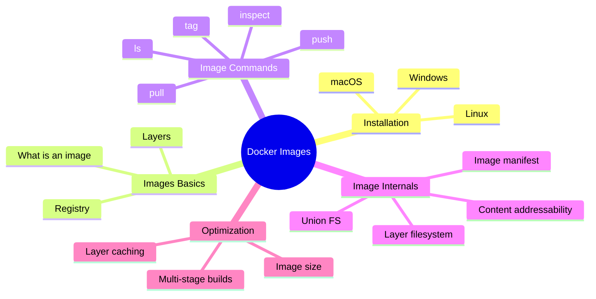
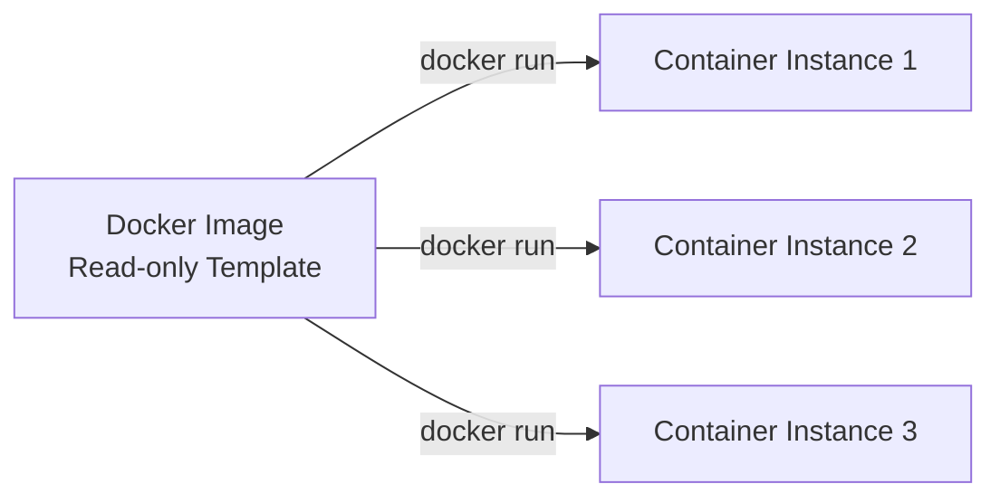
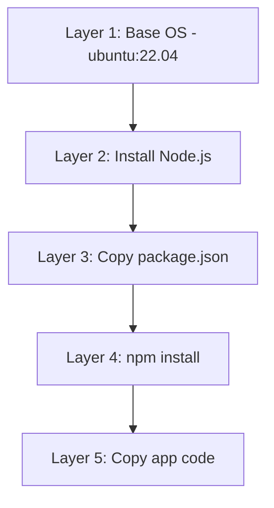
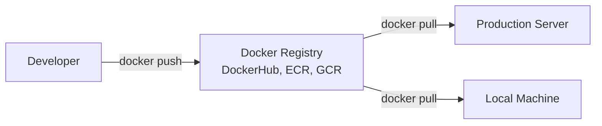
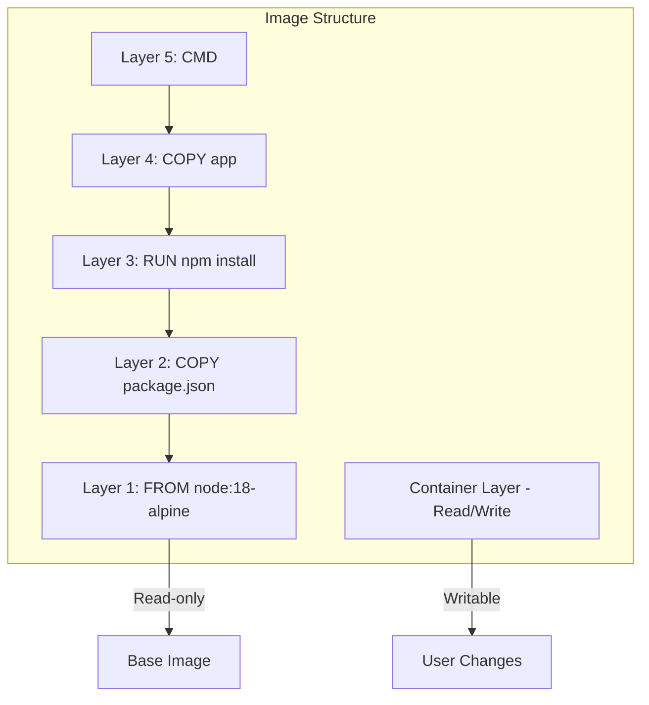
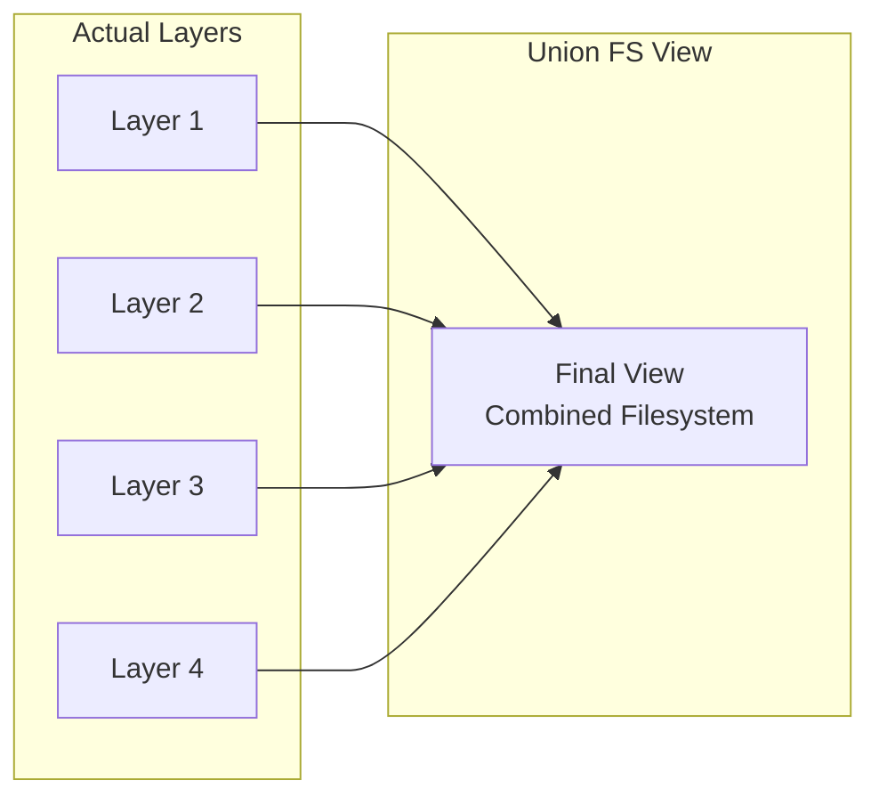
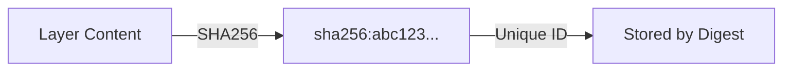
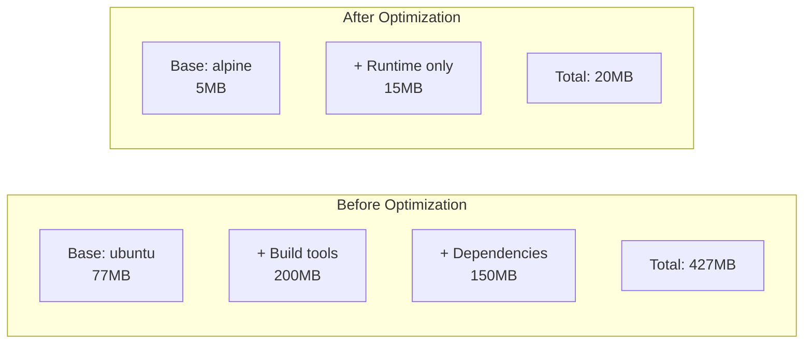

# Lecture 7: Docker Images Deep Dive

## Navigation Map



## 1. Installing Docker

### Linux (Ubuntu/Debian)

```bash
# Update package index
sudo apt-get update

# Install prerequisites
sudo apt-get install -y \
    ca-certificates \
    curl \
    gnupg \
    lsb-release

# Add Docker's official GPG key
sudo mkdir -p /etc/apt/keyrings
curl -fsSL https://download.docker.com/linux/ubuntu/gpg | sudo gpg --dearmor -o /etc/apt/keyrings/docker.gpg

# Set up repository
echo \
  "deb [arch=$(dpkg --print-architecture) signed-by=/etc/apt/keyrings/docker.gpg] https://download.docker.com/linux/ubuntu \
  $(lsb_release -cs) stable" | sudo tee /etc/apt/sources.list.d/docker.list > /dev/null

# Install Docker Engine
sudo apt-get update
sudo apt-get install -y docker-ce docker-ce-cli containerd.io docker-buildx-plugin docker-compose-plugin

# Verify installation
sudo docker run hello-world
```

### Add user to docker group (avoid sudo)

```bash
sudo usermod -aG docker $USER
# Log out and back in for changes to take effect
```

### macOS

```bash
# Install using Homebrew
brew install --cask docker

# Or download Docker Desktop from:
# https://www.docker.com/products/docker-desktop
```

### Windows

Download and install Docker Desktop from: https://www.docker.com/products/docker-desktop

### Verify Installation

```bash
docker --version
docker compose version
docker run hello-world
```

## 2. What is a Docker Image?

A Docker image is a **read-only template** containing:
- Application code
- Runtime environment
- Libraries and dependencies
- Configuration files
- Environment variables

Think of it as a **snapshot** or **blueprint** for creating containers.



## 3. Image Layers

Docker images are built in **layers**. Each layer represents a change or instruction from the Dockerfile.



**Key Points:**
- Each layer is **immutable** (read-only)
- Layers are **cached** for faster builds
- Layers are **shared** between images
- Only changed layers are rebuilt

## 4. Image Registries



**Popular Registries:**
- Docker Hub (public)
- Amazon ECR (AWS)
- Google Container Registry (GCP)
- Azure Container Registry
- Private registries (Harbor, Nexus)

## 5. Basic Image Commands

```bash
# Pull an image from registry
docker pull nginx:alpine

# List local images
docker images
# or
docker image ls

# Search for images on Docker Hub
docker search nginx

# Inspect image details
docker inspect nginx:alpine

# View image history (layers)
docker history nginx:alpine

# Tag an image
docker tag nginx:alpine myapp:v1.0

# Remove an image
docker rmi nginx:alpine
# or
docker image rm nginx:alpine

# Remove all unused images
docker image prune -a
```

## 6. Image Naming Convention

```
[registry/][username/]repository[:tag]
```

**Examples:**
- `nginx` → Docker Hub official image, latest tag
- `nginx:1.24` → Docker Hub nginx, version 1.24
- `myuser/myapp:v1.0` → User's image on Docker Hub
- `gcr.io/myproject/myapp:latest` → Google Container Registry
- `localhost:5000/myapp:dev` → Local private registry

## 7. Image Layers Architecture



## 8. Union File System (UnionFS)

Docker uses a union file system to stack layers on top of each other.



**How it works:**
- Layers are stacked from bottom to top
- Each layer can add, modify, or delete files
- Upper layers override lower layers
- Only changes are stored (not duplicates)

## 9. Image Manifest

An image manifest is a JSON file describing the image structure.

```json
{
  "schemaVersion": 2,
  "mediaType": "application/vnd.docker.distribution.manifest.v2+json",
  "config": {
    "digest": "sha256:abc123...",
    "size": 7023
  },
  "layers": [
    {
      "digest": "sha256:layer1...",
      "size": 2814559
    },
    {
      "digest": "sha256:layer2...",
      "size": 123456
    }
  ]
}
```

## 10. Content Addressability

Each layer is identified by its **SHA256 hash** (digest).



**Benefits:**
- **Deduplication**: Identical layers are stored once
- **Integrity**: Verify content hasn't changed
- **Caching**: Reuse layers across images

## 11. Layer Caching

When building images, Docker caches layers to speed up builds.

```bash
# First build - all layers built
docker build -t myapp:v1 .
# Building...
# Layer 1 ✓
# Layer 2 ✓
# Layer 3 ✓

# Second build - cache used
docker build -t myapp:v1 .
# Using cache for Layer 1
# Using cache for Layer 2
# Using cache for Layer 3
```

**Cache invalidation**: Changing a layer invalidates all subsequent layers.

## 12. Inspecting Image Details

```bash
# Get detailed JSON info
docker inspect nginx:alpine

# Get specific field
docker inspect --format='{{.Architecture}}' nginx:alpine

# View layers and sizes
docker history nginx:alpine

# Example output:
# IMAGE          CREATED       CREATED BY                      SIZE
# abc123...      2 days ago    CMD ["nginx"]                   0B
# def456...      2 days ago    COPY file.conf /etc/nginx/      1.2kB
# ghi789...      2 days ago    RUN apk add --no-cache nginx    8.5MB
```

## 13. Image Size Optimization



**Tips:**
- Use smaller base images (`alpine`, `distroless`)
- Multi-stage builds (separate build and runtime)
- Combine RUN commands to reduce layers
- Remove unnecessary files in same layer
- Use `.dockerignore` file

## 14. Image Tags and Versioning

```bash
# Tag image with multiple tags
docker tag myapp:latest myapp:v1.0
docker tag myapp:latest myapp:stable

# Push all tags
docker push myapp:v1.0
docker push myapp:latest
docker push myapp:stable
```

**Best Practices:**
- Use semantic versioning: `v1.0.0`
- Avoid `latest` in production
- Use specific versions for reproducibility
- Tag with commit hash for traceability

## 15. Sharing Images

### Push to Docker Hub

```bash
# Login
docker login

# Tag with username
docker tag myapp:v1 username/myapp:v1

# Push
docker push username/myapp:v1
```

### Save/Load Images (offline transfer)

```bash
# Save image to tar file
docker save myapp:v1 -o myapp-v1.tar

# Load image from tar file
docker load -i myapp-v1.tar
```

### Export/Import Containers

```bash
# Export running container to tar
docker export container-name -o container.tar

# Import as new image
docker import container.tar myapp:imported
```

## 16. Image Storage Location

**Linux**: `/var/lib/docker/`

```bash
# View storage info
docker system df

# Detailed breakdown
docker system df -v
```

**macOS/Windows**: Inside Docker Desktop VM

## 17. Cleaning Up Images

```bash
# Remove unused images
docker image prune

# Remove all images not used by containers
docker image prune -a

# Remove specific image
docker rmi image-name:tag

# Force remove (even if container using it)
docker rmi -f image-name:tag
```

## 18. Best Practices

1. **Use official base images** from trusted sources
2. **Pin versions** for reproducibility
3. **Minimize layers** by combining commands
4. **Use .dockerignore** to exclude unnecessary files
5. **Scan for vulnerabilities** (Trivy, Snyk)
6. **Sign images** for security
7. **Use multi-stage builds** to reduce size
8. **Keep images small** (alpine, distroless)
9. **Label images** with metadata
10. **Automate builds** with CI/CD

## 19. Quick Reference

| Command | Description |
|---------|-------------|
| `docker pull IMAGE` | Download image |
| `docker images` | List local images |
| `docker inspect IMAGE` | View image details |
| `docker history IMAGE` | Show image layers |
| `docker tag IMAGE NEW` | Tag an image |
| `docker push IMAGE` | Upload to registry |
| `docker rmi IMAGE` | Remove image |
| `docker save -o FILE IMAGE` | Export image |
| `docker load -i FILE` | Import image |

---

End of Lecture 7: Docker Images Deep Dive
