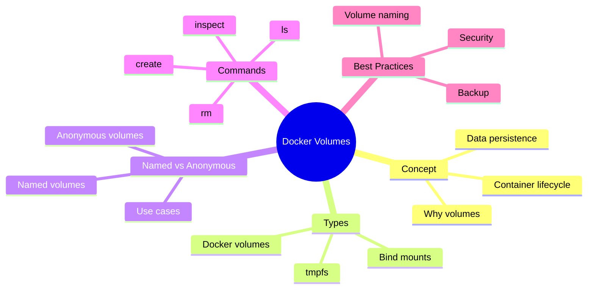
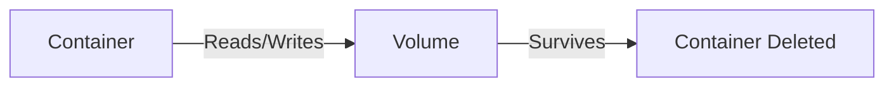
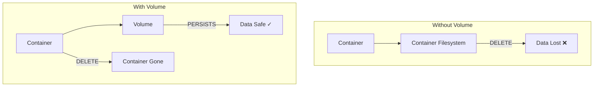
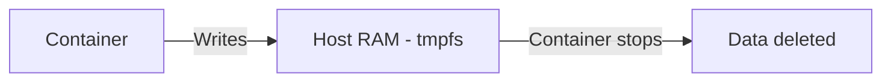
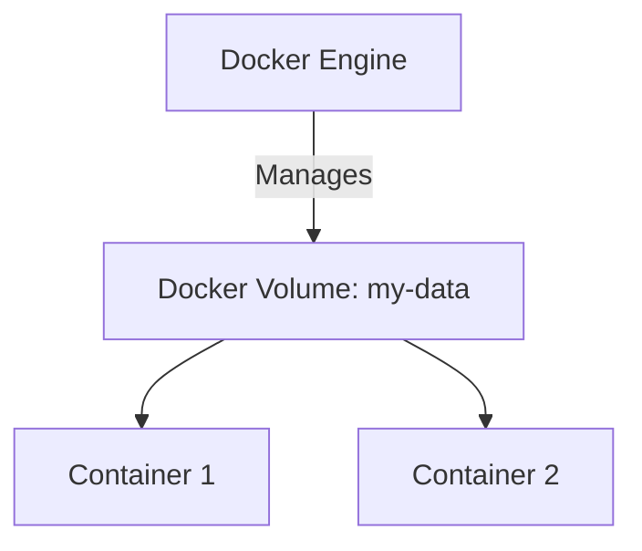
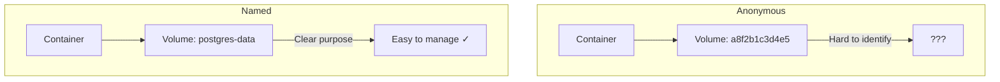
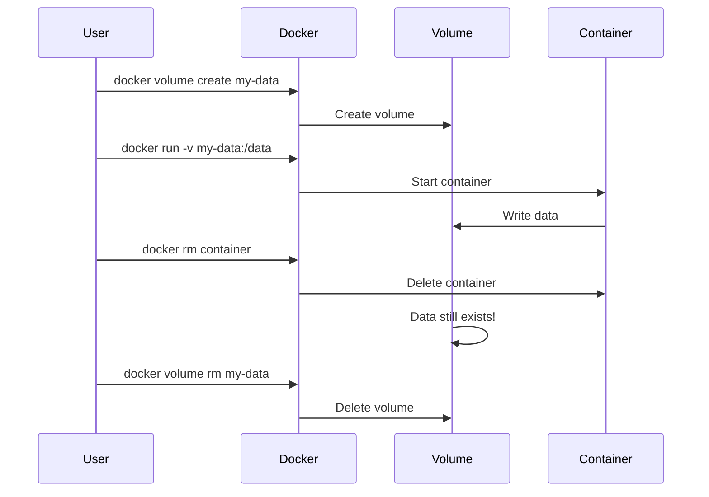

# Lecture 7: Docker Volumes — Data Persistence

## Navigation Map



## 1. Why Do We Need Volumes?

Containers are **ephemeral** — when you delete a container, all data inside it is lost. This is a problem for:
- Databases (PostgreSQL, MySQL, MongoDB)
- Application logs
- User uploads
- Configuration files

**Solution**: Use volumes to persist data outside the container filesystem.



## 2. Container Filesystem vs Volumes



## 3. Types of Docker Storage

Docker offers three types of storage mechanisms:

| Type | Description | Use Case |
|------|-------------|----------|
| **tmpfs** | In-memory storage | Temporary data, secrets |
| **Bind mounts** | Direct host path mapping | Development, config files |
| **Docker volumes** | Managed by Docker | Production databases, persistent data |

## 4. tmpfs Mounts

**What it is**: Data stored in host memory (RAM), never written to disk.

**Characteristics**:
- Super fast
- Data disappears when container stops
- Not persisted to disk
- Good for sensitive data (passwords, tokens)

**Example**:
```bash
docker run -d \
  --name tmpfs-test \
  --tmpfs /app/temp:rw,size=100m \
  nginx:alpine
```

**Diagram**:


## 5. Bind Mounts

**What it is**: Direct mapping between a host directory and container directory.

**Characteristics**:
- You control the exact host path
- Useful for development (live code reloading)
- Host files are directly accessible in container
- Less portable (path must exist on host)

**Example**:
```bash
# Mount current directory to /app in container
docker run -d \
  --name web \
  -v $(pwd):/app \
  -p 8080:80 \
  nginx:alpine
```

**Diagram**:
```mermaid
graph LR
    Host[/home/user/project] <-->|Bind Mount| Container[/app]
```

**Real-world use case**: Development setup
```bash
# Your Node.js app code is in ./src
docker run -d \
  --name dev-app \
  -v $(pwd)/src:/app \
  -p 3000:3000 \
  node:18-alpine \
  node /app/index.js
```

Now editing files on your host immediately reflects in the container!

## 6. Docker Volumes (Managed Volumes)

**What it is**: Volumes managed entirely by Docker. Docker stores them in a special location on the host (`/var/lib/docker/volumes/`).

**Characteristics**:
- Best practice for production
- Docker manages lifecycle
- Can be shared between containers
- Easier to backup and migrate
- Works across different hosts

**Example**:
```bash
# Create a volume
docker volume create my-data

# Use it in a container
docker run -d \
  --name postgres \
  -v my-data:/var/lib/postgresql/data \
  -e POSTGRES_PASSWORD=secret \
  postgres:15-alpine
```

**Diagram**:


## 7. Anonymous vs Named Volumes

### Anonymous Volumes

**What**: Docker creates a volume with a random ID.

**Example**:
```bash
docker run -d \
  --name db \
  -v /var/lib/postgresql/data \
  postgres:15-alpine
```

Docker generates a volume name like `a8f2b1c3d4e5...`

**Problem**: Hard to identify and manage later.

### Named Volumes

**What**: You give the volume a meaningful name.

**Example**:
```bash
docker run -d \
  --name db \
  -v postgres-data:/var/lib/postgresql/data \
  postgres:15-alpine
```

**Benefit**: Easy to find, backup, and reuse.

**Comparison**:



## 8. Common Volume Commands

```bash
# Create a named volume
docker volume create my-volume

# List all volumes
docker volume ls

# Inspect volume details
docker volume inspect my-volume

# Remove a volume
docker volume rm my-volume

# Remove all unused volumes
docker volume prune

# Remove volume when container is removed
docker run --rm -v /data nginx
```

## 9. Practical Examples

### Example 1: PostgreSQL with Named Volume

```bash
# Create volume
docker volume create postgres-data

# Run PostgreSQL
docker run -d \
  --name postgres-db \
  -e POSTGRES_PASSWORD=mypassword \
  -v postgres-data:/var/lib/postgresql/data \
  -p 5432:5432 \
  postgres:15-alpine

# Data persists even if container is deleted
docker rm -f postgres-db

# Recreate container with same data
docker run -d \
  --name postgres-db \
  -e POSTGRES_PASSWORD=mypassword \
  -v postgres-data:/var/lib/postgresql/data \
  -p 5432:5432 \
  postgres:15-alpine
```

### Example 2: Nginx with Bind Mount (Development)

```bash
# Create a simple HTML file
echo "<h1>Hello Docker!</h1>" > index.html

# Run nginx with bind mount
docker run -d \
  --name web \
  -v $(pwd):/usr/share/nginx/html:ro \
  -p 8080:80 \
  nginx:alpine

# Visit http://localhost:8080
# Edit index.html and refresh — changes appear instantly!
```

### Example 3: tmpfs for Secrets

```bash
docker run -d \
  --name secure-app \
  --tmpfs /run/secrets:rw,noexec,nosuid,size=50m \
  myapp:latest
```

## 10. Volume Lifecycle



## 11. Sharing Volumes Between Containers

```bash
# Create shared volume
docker volume create shared-data

# Container 1 writes data
docker run -d --name writer \
  -v shared-data:/data \
  alpine sh -c "echo 'Hello' > /data/message.txt"

# Container 2 reads data
docker run --rm \
  -v shared-data:/data \
  alpine cat /data/message.txt
# Output: Hello
```

## 12. Docker Compose with Volumes

```yaml
version: '3.8'

services:
  db:
    image: postgres:15-alpine
    volumes:
      - postgres-data:/var/lib/postgresql/data
    environment:
      POSTGRES_PASSWORD: secret

  web:
    image: nginx:alpine
    volumes:
      - ./html:/usr/share/nginx/html:ro
      - nginx-logs:/var/log/nginx
    ports:
      - "8080:80"

volumes:
  postgres-data:
  nginx-logs:
```

## 13. Backup and Restore Volumes

### Backup a Volume

```bash
# Backup volume to tar file
docker run --rm \
  -v my-volume:/data \
  -v $(pwd):/backup \
  alpine tar czf /backup/my-volume-backup.tar.gz -C /data .
```

### Restore a Volume

```bash
# Restore from tar file
docker run --rm \
  -v my-volume:/data \
  -v $(pwd):/backup \
  alpine tar xzf /backup/my-volume-backup.tar.gz -C /data
```

## 14. Best Practices

1. **Use named volumes** for production databases
2. **Use bind mounts** for development only
3. **Use tmpfs** for sensitive temporary data
4. **Never store data in container filesystem** for important data
5. **Backup volumes regularly**
6. **Use volume drivers** for network storage (NFS, cloud providers)
7. **Set appropriate permissions** on volumes
8. **Clean up unused volumes** with `docker volume prune`

## 15. Volume Drivers

Docker supports different volume drivers:

- `local` (default) — stores on host
- `nfs` — network file system
- `azure` — Azure File Storage
- `s3` — Amazon S3
- Custom drivers for specialized storage

Example with NFS:
```bash
docker volume create \
  --driver local \
  --opt type=nfs \
  --opt o=addr=192.168.1.100,rw \
  --opt device=:/path/to/share \
  nfs-volume
```

## 16. Troubleshooting

**Problem**: Volume not persisting data
```bash
# Check if volume exists
docker volume ls

# Inspect volume
docker volume inspect my-volume

# Check container mount
docker inspect container-name | grep -A 10 Mounts
```

**Problem**: Permission denied
```bash
# Run container with correct user
docker run -u $(id -u):$(id -g) -v my-volume:/data myapp
```

## 17. Quick Reference

| Command | Description |
|---------|-------------|
| `docker volume create NAME` | Create named volume |
| `docker volume ls` | List volumes |
| `docker volume inspect NAME` | Show volume details |
| `docker volume rm NAME` | Delete volume |
| `docker volume prune` | Remove unused volumes |
| `docker run -v NAME:/path` | Use named volume |
| `docker run -v /host:/container` | Use bind mount |
| `docker run --tmpfs /path` | Use tmpfs |

---

## Summary

- **tmpfs**: Fast, temporary, in-memory storage
- **Bind mounts**: Direct host-to-container path mapping (dev)
- **Docker volumes**: Managed by Docker, best for production
- **Named volumes**: Easy to identify and manage
- **Anonymous volumes**: Auto-generated, harder to track

Use the right volume type for your use case!

---

End of Lecture 7: Docker Volumes
