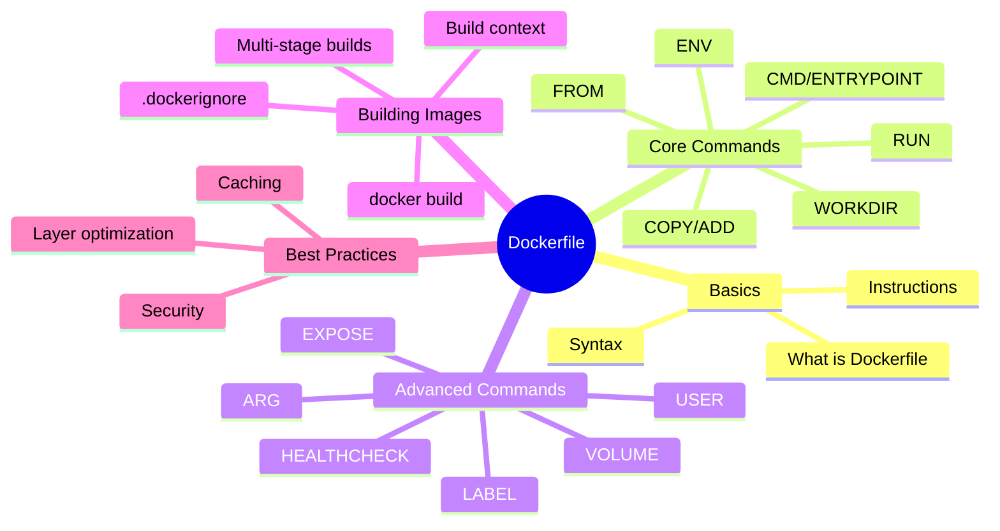
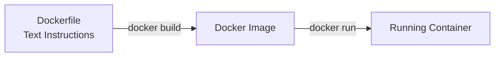
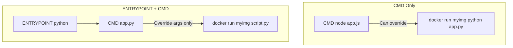
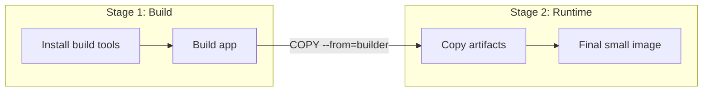

# Lecture 8: Dockerfile and Building Custom Images

## Navigation Map



## 1. What is a Dockerfile?

A Dockerfile is a **text file** containing a series of instructions to build a Docker image.



**Example Simple Dockerfile:**
```dockerfile
FROM node:18-alpine
WORKDIR /app
COPY . .
RUN npm install
CMD ["node", "index.js"]
```

## 2. Dockerfile Instruction Format

```dockerfile
# Comment
INSTRUCTION arguments
```

**Rules:**
- Instructions are case-insensitive (but convention is UPPERCASE)
- Executed in order, top to bottom
- First instruction must be `FROM`
- Each instruction creates a new layer

## 3. Core Dockerfile Commands

### FROM - Base Image

Sets the base image for subsequent instructions.

```dockerfile
# Official image
FROM node:18-alpine

# Specific version
FROM ubuntu:22.04

# Multi-stage build
FROM node:18 AS builder
```

**Syntax:**
```dockerfile
FROM [--platform=<platform>] <image>[:<tag>] [AS <name>]
```

### WORKDIR - Set Working Directory

Sets the working directory for subsequent instructions.

```dockerfile
WORKDIR /app

# All subsequent COPY, RUN, CMD will use /app as base
COPY . .
RUN npm install
```

**Multiple WORKDIR:**
```dockerfile
WORKDIR /app
WORKDIR backend  # Now at /app/backend
WORKDIR ../frontend  # Now at /app/frontend
```

### COPY - Copy Files

Copies files from build context to image.

```dockerfile
# Copy single file
COPY package.json /app/

# Copy directory
COPY ./src /app/src

# Copy everything
COPY . /app/

# Multiple sources
COPY file1.txt file2.txt /destination/

# With ownership
COPY --chown=node:node . /app/
```

### ADD - Copy with Extra Features

Like COPY but with extra features (use COPY unless you need these).

```dockerfile
# Extract tar files automatically
ADD archive.tar.gz /app/

# Download from URL
ADD https://example.com/file.txt /app/
```

**Best Practice:** Use COPY for local files, ADD only for tar extraction.

### RUN - Execute Commands

Executes commands during image build.

```dockerfile
# Shell form (uses /bin/sh -c)
RUN apt-get update && apt-get install -y curl

# Exec form (preferred)
RUN ["apt-get", "update"]

# Multiple commands in one layer
RUN apt-get update && \
    apt-get install -y curl wget && \
    apt-get clean && \
    rm -rf /var/lib/apt/lists/*
```

### CMD - Default Command

Specifies the default command to run when container starts.

```dockerfile
# Exec form (preferred)
CMD ["node", "server.js"]

# Shell form
CMD node server.js

# As parameters to ENTRYPOINT
CMD ["--port", "8080"]
```

**Note:** Only the **last CMD** in Dockerfile is used.

### ENTRYPOINT - Main Executable

Sets the main executable for the container.

```dockerfile
# Exec form
ENTRYPOINT ["python", "app.py"]

# With CMD as default arguments
ENTRYPOINT ["python", "app.py"]
CMD ["--host", "0.0.0.0"]
```

**CMD vs ENTRYPOINT:**



### ENV - Environment Variables

Sets environment variables.

```dockerfile
ENV NODE_ENV=production
ENV PORT=3000
ENV API_URL=https://api.example.com

# Multiple variables
ENV NODE_ENV=production \
    PORT=3000 \
    DEBUG=false
```

**Usage in commands:**
```dockerfile
ENV APP_HOME=/app
WORKDIR $APP_HOME
COPY . $APP_HOME
```

### EXPOSE - Document Ports

Documents which ports the container listens on (doesn't actually publish).

```dockerfile
EXPOSE 80
EXPOSE 443
EXPOSE 8080/tcp
EXPOSE 8081/udp
```

**Note:** This is documentation only. Use `-p` flag to actually publish ports:
```bash
docker run -p 8080:80 myimage
```

### VOLUME - Mount Points

Creates a mount point for volumes.

```dockerfile
VOLUME /data
VOLUME ["/var/log", "/var/db"]
```

## 4. Advanced Commands

### ARG - Build Arguments

Defines variables for build-time only (not available in running container).

```dockerfile
ARG VERSION=latest
ARG BUILD_DATE

FROM node:${VERSION}
LABEL build_date=${BUILD_DATE}

RUN echo "Building version ${VERSION}"
```

**Usage:**
```bash
docker build --build-arg VERSION=18-alpine --build-arg BUILD_DATE=$(date) -t myapp .
```

### LABEL - Metadata

Adds metadata to image.

```dockerfile
LABEL maintainer="user@example.com"
LABEL version="1.0"
LABEL description="My awesome application"
LABEL org.opencontainers.image.authors="Your Name"
```

### USER - Set User

Sets the user for subsequent instructions and container runtime.

```dockerfile
# Create user
RUN addgroup -S appgroup && adduser -S appuser -G appgroup

# Switch to user
USER appuser

# All subsequent RUN, CMD, ENTRYPOINT run as appuser
```

**Security Best Practice:** Never run as root in production.

### HEALTHCHECK - Container Health

Defines how to check if container is healthy.

```dockerfile
HEALTHCHECK --interval=30s --timeout=3s --start-period=5s --retries=3 \
  CMD curl -f http://localhost/ || exit 1
```

## 5. Complete Example - Node.js App

```dockerfile
# Use official Node.js image
FROM node:18-alpine

# Set working directory
WORKDIR /app

# Copy package files first (for better caching)
COPY package*.json ./

# Install dependencies
RUN npm ci --only=production

# Copy application code
COPY . .

# Create non-root user
RUN addgroup -S nodejs && adduser -S nodejs -G nodejs

# Change ownership
RUN chown -R nodejs:nodejs /app

# Switch to non-root user
USER nodejs

# Expose port
EXPOSE 3000

# Health check
HEALTHCHECK --interval=30s --timeout=3s \
  CMD node healthcheck.js

# Start application
CMD ["node", "server.js"]
```

## 6. Multi-Stage Builds

Build and runtime environments in one Dockerfile.

```dockerfile
# Stage 1: Build
FROM node:18 AS builder
WORKDIR /app
COPY package*.json ./
RUN npm install
COPY . .
RUN npm run build

# Stage 2: Production
FROM node:18-alpine
WORKDIR /app
COPY --from=builder /app/dist ./dist
COPY --from=builder /app/node_modules ./node_modules
COPY package*.json ./
EXPOSE 3000
CMD ["node", "dist/server.js"]
```

**Benefits:**
- Smaller final image (no build tools)
- Separate build and runtime dependencies
- Better security (fewer attack vectors)



## 7. Building Images

### Basic Build

```bash
# Build with tag
docker build -t myapp:v1 .

# Build with custom Dockerfile name
docker build -f Dockerfile.dev -t myapp:dev .

# Build with build args
docker build --build-arg NODE_ENV=production -t myapp .

# No cache
docker build --no-cache -t myapp .
```

### Build Context

The `.` at the end is the **build context** — files sent to Docker daemon.

```bash
# Current directory
docker build -t myapp .

# Specific directory
docker build -t myapp ./backend

# Remote Git repo
docker build -t myapp https://github.com/user/repo.git
```

### .dockerignore File

Excludes files from build context (like `.gitignore`).

```
# .dockerignore
node_modules
npm-debug.log
.git
.env
*.md
.vscode
dist
coverage
```

**Benefits:**
- Faster builds (smaller context)
- Better security (no secrets in image)
- Smaller images

## 8. Layer Optimization

### Bad Example (Multiple Layers)

```dockerfile
FROM ubuntu:22.04
RUN apt-get update
RUN apt-get install -y curl
RUN apt-get install -y wget
RUN apt-get install -y vim
```

### Good Example (Single Layer)

```dockerfile
FROM ubuntu:22.04
RUN apt-get update && \
    apt-get install -y \
        curl \
        wget \
        vim && \
    apt-get clean && \
    rm -rf /var/lib/apt/lists/*
```

## 9. Caching Strategy

Place instructions that change **rarely** at the top.

```dockerfile
# ✓ Good - dependencies cached unless package.json changes
FROM node:18-alpine
WORKDIR /app
COPY package*.json ./
RUN npm install
COPY . .

# ✗ Bad - cache invalidated on every code change
FROM node:18-alpine
WORKDIR /app
COPY . .
RUN npm install
```

## 10. Real-World Examples

### Python Flask App

```dockerfile
FROM python:3.11-slim

WORKDIR /app

# Install dependencies
COPY requirements.txt .
RUN pip install --no-cache-dir -r requirements.txt

# Copy app
COPY . .

# Non-root user
RUN useradd -m -u 1000 flask && chown -R flask:flask /app
USER flask

EXPOSE 5000

CMD ["gunicorn", "-b", "0.0.0.0:5000", "app:app"]
```

### Go Application (Multi-stage)

```dockerfile
# Build stage
FROM golang:1.21 AS builder
WORKDIR /app
COPY go.* ./
RUN go mod download
COPY . .
RUN CGO_ENABLED=0 GOOS=linux go build -o server

# Runtime stage
FROM alpine:latest
RUN apk --no-cache add ca-certificates
WORKDIR /root/
COPY --from=builder /app/server .
EXPOSE 8080
CMD ["./server"]
```

### Static Website (Nginx)

```dockerfile
FROM nginx:alpine
COPY nginx.conf /etc/nginx/nginx.conf
COPY ./dist /usr/share/nginx/html
EXPOSE 80
CMD ["nginx", "-g", "daemon off;"]
```

## 11. Best Practices

1. **Use official base images**
2. **Use specific tags** (not `latest`)
3. **Minimize layers** (combine RUN commands)
4. **Use .dockerignore**
5. **Multi-stage builds** for compiled languages
6. **Don't run as root**
7. **Use COPY over ADD**
8. **Pin versions** of dependencies
9. **Clean up in same layer** (apt-get clean)
10. **Use HEALTHCHECK** for production
11. **Label your images**
12. **Scan for vulnerabilities**

## 12. Common Mistakes to Avoid

❌ **Running as root**
```dockerfile
# Bad
USER root
```

✅ **Create and use non-root user**
```dockerfile
# Good
RUN adduser -D appuser
USER appuser
```

❌ **Installing unnecessary packages**
```dockerfile
# Bad
RUN apt-get install -y build-essential git vim emacs
```

✅ **Install only what's needed**
```dockerfile
# Good
RUN apt-get install -y --no-install-recommends curl
```

❌ **Not cleaning up**
```dockerfile
# Bad
RUN apt-get update
RUN apt-get install -y curl
```

✅ **Clean in same layer**
```dockerfile
# Good
RUN apt-get update && \
    apt-get install -y curl && \
    rm -rf /var/lib/apt/lists/*
```

## 13. Building and Testing

```bash
# Build
docker build -t myapp:v1 .

# Test run
docker run --rm -p 8080:8080 myapp:v1

# Check image size
docker images myapp:v1

# Inspect layers
docker history myapp:v1

# Scan for vulnerabilities
docker scan myapp:v1
```

## 14. Quick Reference

| Instruction | Purpose | Example |
|-------------|---------|---------|
| `FROM` | Base image | `FROM node:18-alpine` |
| `WORKDIR` | Set working directory | `WORKDIR /app` |
| `COPY` | Copy files | `COPY . /app` |
| `ADD` | Copy + extract/download | `ADD file.tar.gz /app` |
| `RUN` | Execute command | `RUN npm install` |
| `CMD` | Default command | `CMD ["node", "app.js"]` |
| `ENTRYPOINT` | Main executable | `ENTRYPOINT ["python"]` |
| `ENV` | Set env variable | `ENV PORT=3000` |
| `ARG` | Build argument | `ARG VERSION=latest` |
| `EXPOSE` | Document port | `EXPOSE 8080` |
| `VOLUME` | Mount point | `VOLUME /data` |
| `USER` | Set user | `USER appuser` |
| `LABEL` | Metadata | `LABEL version="1.0"` |
| `HEALTHCHECK` | Health command | `HEALTHCHECK CMD curl localhost` |

---

End of Lecture 8: Dockerfile and Building Custom Images
