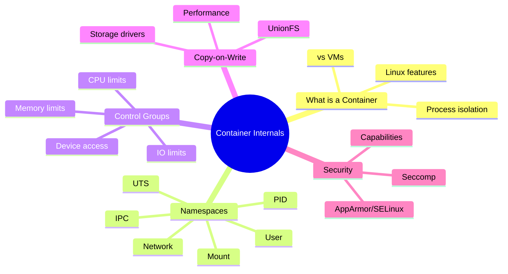
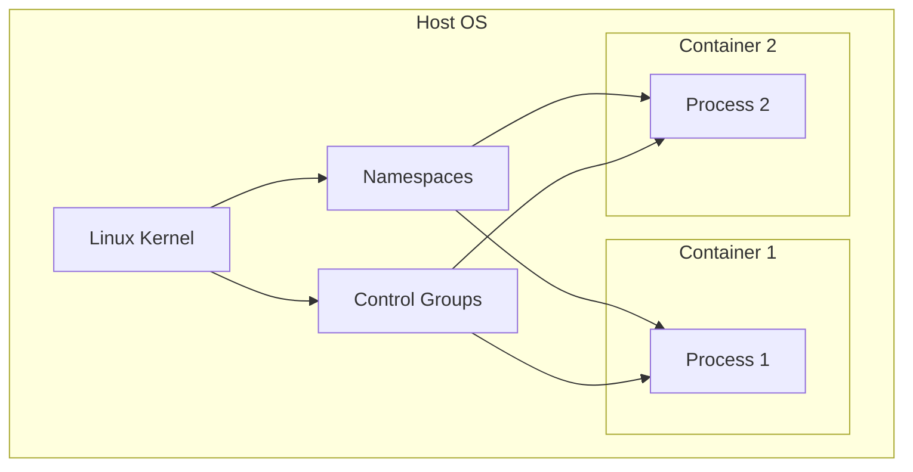
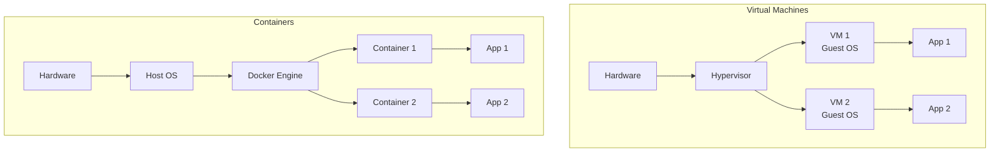
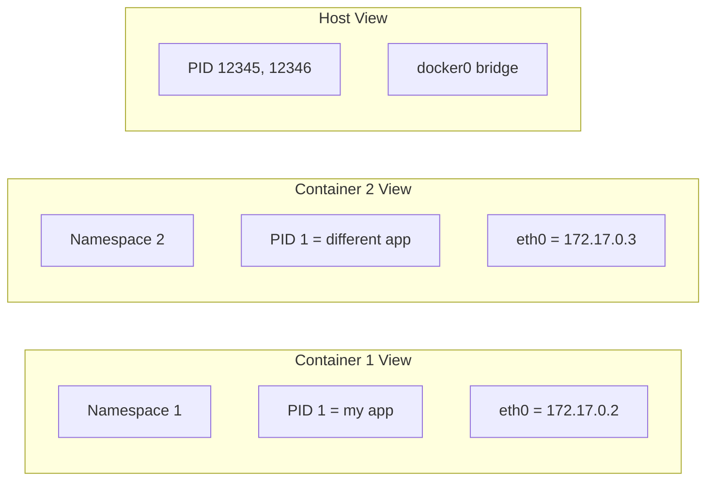
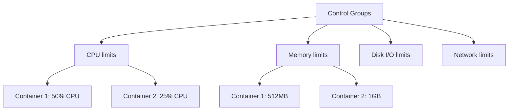
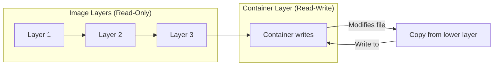
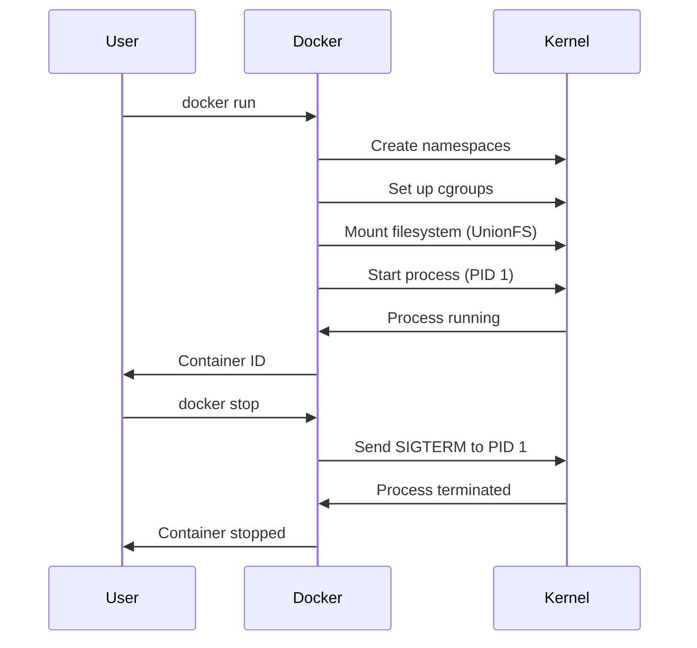

# Lecture 9: Docker Containers Deep Dive — Internals

## Navigation Map



## 1. What IS a Container, Really?

A container is **NOT a virtual machine**. It's a **process** (or group of processes) with:
- Isolated view of system resources
- Resource limits
- Separate filesystem



**Key Point:** Containers share the host kernel but are isolated from each other.

## 2. Containers vs Virtual Machines



| Aspect | Virtual Machine | Container |
|--------|----------------|-----------|
| **OS** | Full guest OS per VM | Share host kernel |
| **Size** | GBs | MBs |
| **Boot time** | Minutes | Milliseconds |
| **Isolation** | Strong (hardware level) | Process level |
| **Performance** | Some overhead | Near-native |
| **Density** | 10s per host | 100s per host |

## 3. Linux Namespaces

Namespaces provide **isolation** — each container sees its own version of system resources.



### Types of Namespaces

#### 1. PID Namespace (Process ID)

Isolates process IDs. Container sees its process as PID 1.

```bash
# Inside container
$ ps aux
PID   USER     COMMAND
1     root     /bin/sh
```

```bash
# On host
$ ps aux | grep container
12345 root     /bin/sh
```

**Demo:**
```bash
# Run container and check PID
docker run -it --rm alpine sh

# Inside container
/ # echo $$
1

# From host (another terminal)
ps aux | grep alpine
```

#### 2. Network Namespace

Isolates network interfaces, IP addresses, routing tables.

```bash
# Container has its own network stack
$ docker run -it alpine ip addr
1: lo: <LOOPBACK,UP>
2: eth0@if15: <BROADCAST,MULTICAST,UP>
    inet 172.17.0.2/16
```

#### 3. Mount Namespace

Isolates filesystem mount points.

```bash
# Container sees its own filesystem
$ docker run alpine mount
overlay on / type overlay
tmpfs on /dev type tmpfs
```

#### 4. UTS Namespace (Hostname)

Isolates hostname and domain name.

```bash
# Set container hostname
docker run --hostname=mycontainer alpine hostname
mycontainer
```

#### 5. IPC Namespace (Inter-Process Communication)

Isolates System V IPC and POSIX message queues.

```bash
# Each container has separate IPC
ipcs -q  # Shows message queues
```

#### 6. User Namespace

Maps container user IDs to different host user IDs.

```bash
# Container root (UID 0) maps to unprivileged host user
# Provides additional security
```

## 4. Control Groups (cgroups)

Control groups **limit and account** for resource usage.



### CPU Limits

```bash
# Limit to 50% of one CPU
docker run --cpus=0.5 nginx

# Set CPU shares (relative weight)
docker run --cpu-shares=512 nginx

# Pin to specific CPUs
docker run --cpuset-cpus="0,1" nginx
```

### Memory Limits

```bash
# Limit memory to 512MB
docker run -m 512m nginx

# Memory + swap limit
docker run -m 512m --memory-swap=1g nginx

# Memory reservation (soft limit)
docker run --memory-reservation=256m nginx
```

### Disk I/O Limits

```bash
# Limit read/write rates
docker run --device-read-bps /dev/sda:1mb nginx
docker run --device-write-bps /dev/sda:1mb nginx

# Limit IOPS
docker run --device-read-iops /dev/sda:100 nginx
```

### Viewing cgroup stats

```bash
# CPU stats
docker stats

# Detailed stats
docker stats --no-stream --format "table {{.Container}}\t{{.CPUPerc}}\t{{.MemUsage}}"
```

## 5. Copy-on-Write (COW) Filesystem

Docker uses COW to optimize storage and performance.



### How COW Works

1. **Read:** If file exists in image, read from layer
2. **Write:** 
   - File doesn't exist → Create new file in container layer
   - File exists → Copy to container layer, then modify

**Example:**
```bash
# Base image has /etc/nginx/nginx.conf
# Container modifies it:
# 1. Copy file to container layer
# 2. Make changes in container layer
# 3. Original image layer unchanged
```

### Benefits of COW

✅ **Fast container creation**
- No need to copy entire filesystem
- Only copy files when modified

✅ **Efficient storage**
- Image layers shared between containers
- Only unique changes stored per container

✅ **Quick snapshots**
- Can commit container changes as new image layer

### Storage Drivers

Different COW implementations:

| Driver | Description | Use Case |
|--------|-------------|----------|
| `overlay2` | Modern, fast, default | General purpose |
| `aufs` | Older, mature | Legacy systems |
| `devicemapper` | Block-level | Production (with direct-lvm) |
| `btrfs` | Advanced filesystem | Advanced users |
| `zfs` | Advanced filesystem | High-performance |

Check your storage driver:
```bash
docker info | grep "Storage Driver"
```

## 6. Container Lifecycle



## 7. Under the Hood: Running a Container

```bash
docker run -d --name web nginx
```

**What happens:**

1. **Image layers** are mounted using UnionFS
2. **New namespaces** created (PID, network, mount, etc.)
3. **Cgroups** configured for resource limits
4. **Network** configured (bridge, veth pair)
5. **Process** started as PID 1 in container
6. **Container layer** created for writes

## 8. Inspecting Container Internals

```bash
# Get container PID on host
docker inspect -f '{{.State.Pid}}' web

# View namespaces
ls -la /proc/<PID>/ns/

# View cgroups
cat /sys/fs/cgroup/memory/docker/<container-id>/memory.limit_in_bytes

# View mount points
docker inspect -f '{{.GraphDriver}}' web
```

## 9. Security Implications

### Linux Capabilities

Instead of all-or-nothing root, Docker uses capabilities.

```bash
# Drop capabilities
docker run --cap-drop=ALL --cap-add=NET_BIND_SERVICE nginx

# Default capabilities
docker run --rm alpine capsh --print
```

### Seccomp (Secure Computing Mode)

Restricts system calls available to container.

```bash
# Custom seccomp profile
docker run --security-opt seccomp=profile.json nginx
```

### AppArmor / SELinux

Additional MAC (Mandatory Access Control) security.

```bash
# AppArmor profile
docker run --security-opt apparmor=docker-default nginx
```

## 10. Performance Optimization

### Why Containers are Fast

1. **No guest OS overhead**
2. **Shared kernel**
3. **Copy-on-Write** filesystem
4. **Instant startup** (just process fork)

### Measuring Performance

```bash
# Resource usage
docker stats

# System calls
docker run --rm alpine strace ls

# Benchmark startup time
time docker run --rm alpine echo "hello"
```

## 11. Practical Demonstrations

### Demo 1: Namespace Isolation

```bash
# Terminal 1: Run container
docker run -it --name demo alpine sh

# Terminal 2: Check host PID
docker inspect -f '{{.State.Pid}}' demo

# Terminal 2: Enter container namespace
nsenter -t <PID> -n -p -m sh
```

### Demo 2: Resource Limits

```bash
# Run with memory limit
docker run -it -m 100m --name stress alpine sh

# Inside container, install and run stress tool
apk add --no-cache stress-ng
stress-ng --vm 1 --vm-bytes 200M
# Container will be killed (OOM)
```

### Demo 3: COW in Action

```bash
# Start container
docker run -d --name cow nginx

# Check disk usage
docker ps -s

# Modify file
docker exec cow sh -c "echo 'test' >> /usr/share/nginx/html/index.html"

# Check disk usage again (increased)
docker ps -s
```

## 12. Best Practices

1. **Set resource limits** to prevent resource exhaustion
2. **Use read-only filesystem** when possible (`--read-only`)
3. **Drop unnecessary capabilities**
4. **Don't run as root** inside containers
5. **Use user namespaces** for additional security
6. **Monitor container stats** in production
7. **Understand COW** to optimize storage
8. **Use appropriate storage driver** for workload

## 13. Troubleshooting

```bash
# Check if kernel supports namespaces
ls -l /proc/$$/ns/

# Verify cgroup support
docker info | grep -i cgroup

# Check storage driver
docker info | grep "Storage Driver"

# View detailed container process
docker top container-name

# Inspect low-level details
docker inspect container-name
```

## 14. Summary

**Containers are:**
- Isolated processes using namespaces
- Resource-limited using cgroups
- Efficient with Copy-on-Write filesystems

**Key Technologies:**
- **Namespaces** → Isolation (PID, network, mount, UTS, IPC, user)
- **Cgroups** → Resource limits (CPU, memory, I/O)
- **UnionFS** → Layered filesystem with COW

**Benefits:**
- Fast startup (no OS boot)
- Efficient storage (shared layers)
- Good performance (native execution)
- High density (many containers per host)

---

End of Lecture 9: Docker Containers Deep Dive
