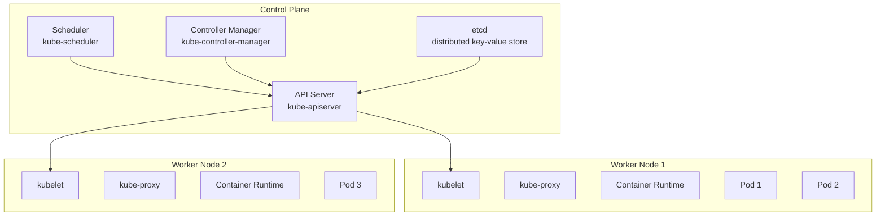
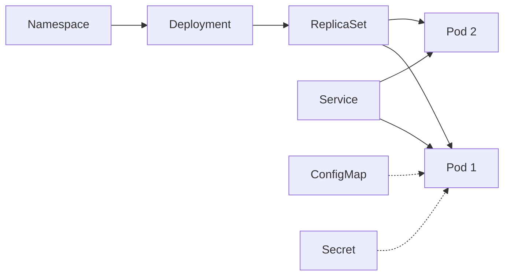

# Lecture 11 — Kubernetes Introduction (Container Orchestration)

This lecture introduces Kubernetes (K8s), the industry-standard container orchestration platform. You'll learn core concepts, architecture, key objects, and how to deploy your first application on a local cluster.

## What you'll learn

- What Kubernetes is and why it's needed
- Core architecture (control plane, nodes, pods)
- Key Kubernetes objects (Pods, Deployments, Services, ConfigMaps, Secrets)
- Quick-start with Minikube or kind
- Basic `kubectl` commands and a hands-on lab
- When to use Kubernetes vs simpler solutions

---

## 1 — What is Kubernetes?

Kubernetes is an open-source platform for automating deployment, scaling, and management of containerized applications. It orchestrates containers across a cluster of machines.

**Key capabilities:**
- Automatic scheduling and placement of containers
- Self-healing (restart failed containers, replace nodes)
- Horizontal scaling (add/remove pods based on load)
- Service discovery and load balancing
- Rolling updates and rollbacks
- Secret and configuration management
- Storage orchestration

**One-line summary:** Kubernetes takes your containers and runs them reliably at scale across a cluster.

---

## 2 — Why Kubernetes? (short)

- Docker Compose works for single-host; Kubernetes works for multi-host clusters
- Production-grade: handles failures, scales automatically, zero-downtime deployments
- Vendor-neutral: runs on AWS (EKS), GCP (GKE), Azure (AKS), on-prem
- Ecosystem: vast tooling (Helm, Prometheus, Istio, ArgoCD)

**When NOT to use Kubernetes:**
- Small apps that fit on one machine (use Docker Compose or a single VM)
- Learning curve and ops overhead may not be worth it for simple workloads

---

## 3 — Kubernetes Architecture (high-level)



**Control Plane (master):**
- **API Server** — frontend for Kubernetes; all operations go through it
- **etcd** — stores cluster state (desired state, current state)
- **Scheduler** — assigns pods to nodes based on resources
- **Controller Manager** — runs controllers (e.g., ReplicaSet, Deployment controllers)

**Worker Nodes:**
- **kubelet** — agent that runs on each node; starts/stops pods
- **kube-proxy** — handles networking rules for service discovery
- **Container Runtime** — Docker, containerd, or CRI-O

---

## 4 — Core Kubernetes Objects



### Pod
- Smallest deployable unit; wraps one or more containers
- Containers in a pod share network namespace and can share volumes
- Pods are ephemeral (not persistent)

### ReplicaSet
- Ensures a specified number of pod replicas are running
- Usually managed by Deployment (don't create ReplicaSets directly)

### Deployment
- Manages ReplicaSets and provides declarative updates
- Supports rolling updates, rollbacks, scaling

### Service
- Stable network endpoint to access a set of pods
- Types: ClusterIP (internal), NodePort (external via node port), LoadBalancer (cloud LB)

### ConfigMap & Secret
- ConfigMap: store non-sensitive config (env vars, files)
- Secret: store sensitive data (passwords, tokens) — base64 encoded

### Namespace
- Virtual cluster for organizing resources; logical isolation

---

## 5 — Install (local Kubernetes cluster)

### Option A: Minikube (single-node cluster)

macOS/Linux:

```bash
# Install Minikube
brew install minikube

# Install kubectl (Kubernetes CLI)
brew install kubectl

# Start Minikube (uses Docker driver by default)
minikube start

# Verify
kubectl cluster-info
kubectl get nodes
```

### Option B: kind (Kubernetes IN Docker)

```bash
# Install kind
brew install kind

# Create cluster
kind create cluster --name dev

# Verify
kubectl cluster-info --context kind-dev
kubectl get nodes
```

Both tools create a local Kubernetes cluster for development.

---

## 6 — Minimal hands-on lab (10 minutes)

**Goal:** Deploy an Nginx app with 3 replicas, expose it via a Service, and access it.

### Step 1: Start cluster

```bash
minikube start
# or
kind create cluster --name lab
```

### Step 2: Create a Deployment

Save as `nginx-deployment.yaml`:

```yaml
apiVersion: apps/v1
kind: Deployment
metadata:
  name: nginx-deployment
  labels:
    app: nginx
spec:
  replicas: 3
  selector:
    matchLabels:
      app: nginx
  template:
    metadata:
      labels:
        app: nginx
    spec:
      containers:
      - name: nginx
        image: nginx:alpine
        ports:
        - containerPort: 80
```

Apply:

```bash
kubectl apply -f nginx-deployment.yaml
kubectl get deployments
kubectl get pods
```

You should see 3 pods running.

### Step 3: Expose with a Service

Save as `nginx-service.yaml`:

```yaml
apiVersion: v1
kind: Service
metadata:
  name: nginx-service
spec:
  type: NodePort
  selector:
    app: nginx
  ports:
    - protocol: TCP
      port: 80
      targetPort: 80
      nodePort: 30080
```

Apply:

```bash
kubectl apply -f nginx-service.yaml
kubectl get services
```

### Step 4: Access the app

For Minikube:

```bash
minikube service nginx-service --url
# Open the URL in your browser
```

For kind:

```bash
kubectl port-forward service/nginx-service 8080:80
# Open http://localhost:8080
```

### Step 5: Scale the deployment

```bash
kubectl scale deployment nginx-deployment --replicas=5
kubectl get pods
```

You should see 5 pods now.

### Step 6: Cleanup

```bash
kubectl delete -f nginx-service.yaml
kubectl delete -f nginx-deployment.yaml
# Stop cluster
minikube stop
# or
kind delete cluster --name lab
```

---

## 7 — Essential kubectl commands (cheat-sheet)

**Cluster & context:**

```bash
kubectl cluster-info
kubectl config get-contexts
kubectl config use-context <context>
```

**Resources:**

```bash
kubectl get pods
kubectl get deployments
kubectl get services
kubectl get all                     # all resources in current namespace
kubectl get pods -n <namespace>     # pods in specific namespace
kubectl get pods -A                 # all namespaces
```

**Detailed info:**

```bash
kubectl describe pod <pod-name>
kubectl logs <pod-name>
kubectl logs -f <pod-name>          # follow logs
kubectl exec -it <pod-name> -- sh   # open shell in pod
```

**Apply/Delete:**

```bash
kubectl apply -f <file.yaml>
kubectl delete -f <file.yaml>
kubectl delete pod <pod-name>
kubectl delete deployment <name>
```

**Scaling & updates:**

```bash
kubectl scale deployment <name> --replicas=5
kubectl set image deployment/<name> <container>=<image:tag>
kubectl rollout status deployment/<name>
kubectl rollout undo deployment/<name>
```

**Debugging:**

```bash
kubectl get events
kubectl top nodes                   # requires metrics-server
kubectl top pods
```

---

## 8 — Declarative vs Imperative

Kubernetes supports two approaches:

**Imperative (commands):**

```bash
kubectl create deployment nginx --image=nginx:alpine
kubectl expose deployment nginx --port=80 --type=NodePort
kubectl scale deployment nginx --replicas=3
```

Good for learning and quick tests.

**Declarative (YAML files):**

```bash
kubectl apply -f deployment.yaml
```

Preferred for production: version-controlled, repeatable, auditable.

---

## 9 — Namespaces (logical isolation)

```bash
# List namespaces
kubectl get namespaces

# Create namespace
kubectl create namespace dev

# Deploy to namespace
kubectl apply -f deployment.yaml -n dev

# Get resources in namespace
kubectl get pods -n dev

# Set default namespace
kubectl config set-context --current --namespace=dev
```

Common namespaces:
- `default` — user resources
- `kube-system` — Kubernetes system components
- `kube-public` — public resources

---

## 10 — ConfigMaps & Secrets (config management)

### ConfigMap example

```yaml
apiVersion: v1
kind: ConfigMap
metadata:
  name: app-config
data:
  DATABASE_HOST: "postgres.default.svc.cluster.local"
  DATABASE_PORT: "5432"
```

Use in pod:

```yaml
spec:
  containers:
  - name: app
    image: myapp:1.0
    envFrom:
    - configMapRef:
        name: app-config
```

### Secret example

```bash
# Create secret from literal
kubectl create secret generic db-secret \
  --from-literal=username=admin \
  --from-literal=password=secret123
```

Use in pod:

```yaml
spec:
  containers:
  - name: app
    image: myapp:1.0
    env:
    - name: DB_USER
      valueFrom:
        secretKeyRef:
          name: db-secret
          key: username
    - name: DB_PASS
      valueFrom:
        secretKeyRef:
          name: db-secret
          key: password
```

---

## 11 — Persistent storage (Volumes & PVCs)

```yaml
apiVersion: v1
kind: PersistentVolumeClaim
metadata:
  name: app-pvc
spec:
  accessModes:
    - ReadWriteOnce
  resources:
    requests:
      storage: 1Gi
```

Use in Deployment:

```yaml
spec:
  template:
    spec:
      containers:
      - name: app
        image: myapp:1.0
        volumeMounts:
        - name: data
          mountPath: /data
      volumes:
      - name: data
        persistentVolumeClaim:
          claimName: app-pvc
```

---

## 12 — Health checks (Liveness & Readiness probes)

```yaml
spec:
  containers:
  - name: app
    image: myapp:1.0
    livenessProbe:
      httpGet:
        path: /healthz
        port: 8080
      initialDelaySeconds: 10
      periodSeconds: 5
    readinessProbe:
      httpGet:
        path: /ready
        port: 8080
      initialDelaySeconds: 5
      periodSeconds: 3
```

- **Liveness probe** — restart container if it fails
- **Readiness probe** — stop sending traffic if it fails

---

## 13 — Best practices (short)

- Use Deployments (not bare pods or ReplicaSets)
- Set resource requests and limits for CPU/memory
- Use health checks (liveness & readiness probes)
- Store config in ConfigMaps/Secrets (not hardcoded)
- Use namespaces for logical separation (dev, staging, prod)
- Version your manifests in Git
- Use labels and annotations for organization
- Avoid `latest` tag; pin image versions

---

## 14 — Kubernetes ecosystem (brief)

- **Helm** — package manager for Kubernetes (templates, charts)
- **Prometheus + Grafana** — monitoring and metrics
- **Istio / Linkerd** — service mesh (traffic management, security, observability)
- **ArgoCD / Flux** — GitOps continuous delivery
- **Cert-Manager** — automated TLS certificate management
- **Ingress Controllers** (Nginx, Traefik) — HTTP routing

---

## 15 — Production Kubernetes (managed services)

Local clusters (Minikube, kind, k3s) are for learning. For production:

- **AWS EKS** (Elastic Kubernetes Service)
- **GCP GKE** (Google Kubernetes Engine)
- **Azure AKS** (Azure Kubernetes Service)
- **DigitalOcean Kubernetes**
- **On-prem** (kubeadm, Rancher, OpenShift)

Managed services handle control plane, upgrades, and backups.

---

## 16 — Comparison: Docker Compose vs Kubernetes

| Feature | Docker Compose | Kubernetes |
|---|---|---|
| Scope | Single host | Multi-host cluster |
| Scaling | Manual | Automatic (HPA) |
| Self-healing | No | Yes |
| Load balancing | Limited | Built-in Services |
| Rolling updates | No | Yes |
| Complexity | Low | High |
| Use case | Dev/test | Production at scale |

---

## 17 — Where to go next (recommended)

1. Complete the hands-on lab above (deploy, scale, expose).
2. Read official Kubernetes docs: [https://kubernetes.io/docs/](https://kubernetes.io/docs/)
3. Learn Helm for package management.
4. Deploy a multi-tier app (web + database + redis) on Kubernetes.
5. Explore managed Kubernetes (create an EKS/GKE cluster).
6. Study CI/CD with Kubernetes (ArgoCD, GitHub Actions).

---

## 18 — Practice exercises (recommended)

1. Deploy a simple Node.js or Go app with ConfigMap for environment variables.
2. Create a Service of type LoadBalancer (requires cloud provider or MetalLB).
3. Use a StatefulSet to deploy a database (PostgreSQL or MySQL).
4. Set up Ingress with nginx-ingress-controller for HTTP routing.
5. Implement horizontal pod autoscaling (HPA) based on CPU usage.

---

End of Lecture 11 — Kubernetes Introduction
