# Lecture 11 — Kubernetes Introduction (Container Orchestration)

This lecture introduces container orchestration and Kubernetes (K8s), the industry-standard platform for managing containerized applications at scale. You'll understand why orchestration is critical, explore Kubernetes architecture in detail, and deploy your first application.

## What you'll learn (SST 2027 Batch C13 Syllabus)

- **What is container orchestration**
- **Why do you need container orchestration**
- **What is Kubernetes**
- **Why do you need Kubernetes**
- **Kubernetes architecture** (control plane, worker nodes, components)
- Key Kubernetes objects and hands-on lab

---

## 1 — What is Container Orchestration?

**Container orchestration** is the automated management, coordination, and scheduling of containerized applications across multiple hosts (cluster). It handles the entire lifecycle: deployment, scaling, networking, health monitoring, and failover.


**What orchestration does:**
- **Automated deployment** — you declare "run 10 replicas of app X"; orchestrator makes it happen
- **Intelligent scheduling** — places containers on hosts based on available CPU, memory, and constraints
- **Auto-scaling** — adds or removes container instances dynamically based on load
- **Self-healing** — detects failures and automatically restarts containers or reschedules to healthy nodes
- **Load balancing** — distributes incoming traffic across healthy container instances
- **Service discovery** — containers automatically find and communicate with each other
- **Rolling updates** — deploys new versions with zero downtime (gradual rollout)
- **Rollback** — reverts to previous version if new deployment fails
- **Resource management** — ensures fair allocation of CPU and memory; prevents resource starvation

---

## 2 — Why Do You Need Container Orchestration?

Running containers manually with `docker run` works for development or small apps on a single host. But production workloads at scale require orchestration.

### Problems without orchestration:

**1. Manual scaling is slow and error-prone**
```bash
# Traffic spike happens
# You manually SSH to 5 servers and run docker run 10 times each = 50 manual commands
ssh server1
docker run -d myapp
docker run -d myapp
# ... repeat 48 more times manually
```
- No automation
- Slow response to load changes
- Human errors (typos, wrong versions, missed servers)

**2. No self-healing**
```bash
# Container crashes at 3 AM
# It stays down until you wake up and manually restart it
docker ps  # shows container is gone
docker run -d myapp  # manual restart
```
- Downtime until manual intervention
- Host failure = all containers on that host lost permanently

**3. Complex networking and service discovery**
```bash
# App on server1 needs to talk to database on server2
# You hardcode IP addresses in config files
DB_HOST=192.168.1.42  # what if this IP changes?
```
- Manual IP management
- Reconfigure every time a container moves
- No automatic load balancing

**4. Inefficient resource usage**
```bash
# You guess which server has capacity
ssh server3  # maybe this one has space?
docker run -d myapp
# Error: not enough memory
ssh server5  # try another one
docker run -d myapp  # finally works
```
- No visibility into resource utilization
- Wasted resources (some servers idle, others overloaded)

**5. Difficult updates and rollbacks**
```bash
# Deploy new version across 10 servers
for i in {1..10}; do
  ssh server$i "docker stop app && docker rm app && docker run -d app:v2"
done
# Oops, v2 has a bug — now manually rollback on all 10 servers
```
- No zero-downtime deployments
- Rollback is manual and error-prone
- Coordination nightmare

**6. No centralized management**
- Containers scattered across many hosts
- Hard to get unified view of what's running where
- Difficult to monitor, log, debug

### Solution: Container Orchestration

An orchestrator like Kubernetes solves all these problems:

```yaml
# Declarative config — just describe what you want
apiVersion: apps/v1
kind: Deployment
metadata:
  name: myapp
spec:
  replicas: 10  # Kubernetes ensures 10 are always running
  template:
    spec:
      containers:
      - name: myapp
        image: myapp:v1
```

```bash
kubectl apply -f deployment.yaml
# Kubernetes automatically:
# - Schedules 10 pods across available nodes (intelligent placement)
# - Monitors health and restarts failures
# - Provides service discovery and load balancing
# - Scales up/down on demand
# - Performs rolling updates with zero downtime
```

**Benefits:**
- **Faster response** — scale from 10 to 100 replicas in seconds
- **Higher availability** — automatic restarts, rescheduling
- **Simplified operations** — single API to manage entire cluster
- **Efficient resource use** — optimal placement, bin-packing
- **Easier deployments** — rolling updates, automated rollbacks

---

## 3 — What is Kubernetes?

**Kubernetes (K8s)** is an open-source container orchestration platform for automating deployment, scaling, and management of containerized applications. Originally developed by Google (based on internal Borg system), now maintained by CNCF (Cloud Native Computing Foundation).


**Kubernetes at a glance:**
- **Open-source** — free, community-driven, CNCF project
- **Vendor-neutral** — runs anywhere (AWS, GCP, Azure, on-premises, bare metal)
- **Production-grade** — battle-tested (Google runs billions of containers per week on Kubernetes ancestors)
- **Declarative** — you describe desired state (YAML manifests), Kubernetes makes it happen
- **Extensible** — plugins, custom resources, operators
- **Rich ecosystem** — Helm, Prometheus, Grafana, Istio, ArgoCD, etc.

**Key concepts:**
- **Cluster** — group of machines (nodes) that run containerized applications
- **Node** — physical or virtual machine in the cluster
- **Pod** — smallest deployable unit (wraps one or more containers)
- **Controller** — ensures desired state matches actual state (e.g., Deployment, StatefulSet)
- **Service** — stable network endpoint for accessing pods
- **API-driven** — everything is a resource managed via Kubernetes API

**What Kubernetes is NOT:**
- Not a single binary (it's a distributed system with multiple components)
- Not just for Google-scale companies (but has operational complexity)
- Not a container runtime (it uses Docker, containerd, CRI-O under the hood)
- Not a PaaS (but can be used to build one)

---

## 4 — Why Do You Need Kubernetes?

### Why Kubernetes specifically? (vs other orchestrators like Docker Swarm, Nomad, ECS)

**1. Industry standard and ecosystem**
- Most widely adopted orchestrator (largest market share)
- Massive ecosystem of tools and extensions
- Large talent pool (easier to hire Kubernetes engineers)
- Extensive documentation and community support

**2. Cloud-native and portable**
- All major clouds offer managed Kubernetes:
  - AWS: EKS (Elastic Kubernetes Service)
  - GCP: GKE (Google Kubernetes Engine)
  - Azure: AKS (Azure Kubernetes Service)
- Avoid vendor lock-in (deploy same manifests across any cloud or on-prem)

**3. Rich feature set**
- **Advanced scheduling**: node affinity, taints, tolerations, pod priority
- **Workload types**: Deployments (stateless), StatefulSets (databases), DaemonSets (node agents), Jobs, CronJobs
- **Auto-scaling**: Horizontal Pod Autoscaler (HPA), Vertical Pod Autoscaler (VPA), Cluster Autoscaler
- **Storage**: Persistent Volumes, dynamic provisioning, CSI (Container Storage Interface)
- **Networking**: CNI plugins, Network Policies, Ingress controllers
- **Security**: RBAC, Pod Security Policies, Secrets, Service Accounts

**4. Declarative and GitOps-friendly**
```yaml
# Everything is code (Infrastructure as Code)
apiVersion: apps/v1
kind: Deployment
# ... store in Git, version control, code review
```
- Manifests stored in Git → full audit trail
- Easy CI/CD integration (apply manifests from pipeline)
- Rollback = revert Git commit

**5. Self-healing and resilience**
- Automatic pod restarts on failure
- Rescheduling when nodes fail
- Health checks (liveness, readiness, startup probes)
- Rolling updates with automatic rollback on failure

**6. Multi-tenancy and isolation**
- Namespaces for logical separation (dev, staging, prod)
- Resource quotas and limit ranges
- Network policies for traffic isolation

### When you SHOULD use Kubernetes:

✅ **Production workloads requiring high availability**  
✅ **Microservices architecture with many services**  
✅ **Multi-cloud or hybrid cloud deployments**  
✅ **Need auto-scaling based on load**  
✅ **Team has DevOps/SRE expertise**  
✅ **Applications that benefit from self-healing**  

### When you SHOULD NOT use Kubernetes:

❌ **Small, simple apps** — Docker Compose on single server is enough  
❌ **Learning/prototyping stage** — start simpler (Docker, then maybe orchestration later)  
❌ **Limited ops expertise** — steep learning curve; need dedicated ops team  
❌ **Cost-sensitive** — managed K8s services + ops overhead add cost  
❌ **Monolithic app on single server** — over-engineering  

**Bottom line:** Use Kubernetes when you need production-grade orchestration, multi-host scaling, self-healing, and portability. Skip it if you're just starting with containers or running small apps.

---

## 5 — Kubernetes Architecture (Deep Dive)

Kubernetes follows a **master-worker architecture** (now called **control plane - worker nodes** architecture). The control plane manages the cluster, and worker nodes run the actual application workloads.

```mermaid
graph TB
    subgraph Control_Plane[🎛️ Control Plane - Master Node]
        API[kube-apiserver<br/>REST API frontend]
        ETCD[etcd<br/>distributed key-value store]
        SCHED[kube-scheduler<br/>pod placement]
        CM[kube-controller-manager<br/>reconciliation loops]
        CCM[cloud-controller-manager<br/>cloud provider integration]
    end
    
    subgraph Worker_Node_1[⚙️ Worker Node 1]
        KUBELET1[kubelet<br/>node agent]
        PROXY1[kube-proxy<br/>network proxy]
        RUNTIME1[Container Runtime<br/>containerd/CRI-O]
        POD1[Pod 1<br/>App A]
        POD2[Pod 2<br/>App B]
    end
    
    subgraph Worker_Node_2[⚙️ Worker Node 2]
        KUBELET2[kubelet<br/>node agent]
        PROXY2[kube-proxy<br/>network proxy]
        RUNTIME2[Container Runtime<br/>containerd/CRI-O]
        POD3[Pod 3<br/>App A]
        POD4[Pod 4<br/>App C]
    end
    
    USER[👤 User<br/>kubectl] -->|HTTPS| API
    API <-->|Read/Write cluster state| ETCD
    SCHED -->|Watch unscheduled pods| API
    CM -->|Watch resources & reconcile| API
    CCM -->|Cloud API calls| API
    
    API -->|Watch for pod changes| KUBELET1
    API -->|Watch for pod changes| KUBELET2
    
    KUBELET1 -->|Manage containers| RUNTIME1
    KUBELET2 -->|Manage containers| RUNTIME2
    
    RUNTIME1 --> POD1
    RUNTIME1 --> POD2
    RUNTIME2 --> POD3
    RUNTIME2 --> POD4
    
    PROXY1 -.->|Network rules| POD1
    PROXY1 -.->|Network rules| POD2
    PROXY2 -.->|Network rules| POD3
    PROXY2 -.->|Network rules| POD4
```



### Control Plane Components (Master)

The control plane makes global decisions about the cluster (scheduling, detecting and responding to events). It can run on any node, but usually runs on dedicated master nodes.

#### 1. **kube-apiserver**
- **Purpose**: Frontend for Kubernetes; exposes Kubernetes API (REST)
- **What it does**:
  - All communication goes through API server (kubectl, kubelet, controllers)
  - Validates and processes API requests
  - Updates etcd with cluster state
  - Only component that talks to etcd directly
- **Example**: When you run `kubectl apply -f deployment.yaml`, kubectl sends HTTP POST to kube-apiserver

#### 2. **etcd**
- **Purpose**: Distributed, reliable key-value store for all cluster data
- **What it does**:
  - Stores entire cluster state (pods, services, configs, secrets)
  - Provides consistency and reliability (Raft consensus algorithm)
  - Backing store for all cluster data
- **Critical**: If etcd is lost, you lose cluster state → regular backups essential
- **Example**: Stores "Deployment X should have 3 replicas"

#### 3. **kube-scheduler**
- **Purpose**: Watches for newly created pods with no assigned node and selects a node for them
- **What it does**:
  - Monitors API server for unscheduled pods
  - Runs scheduling algorithm (filters + scores nodes)
  - Considers: resource requirements, affinity/anti-affinity, taints/tolerations, data locality
  - Updates pod spec with selected node
- **Example**: Pod needs 2 CPU, 4GB RAM → scheduler finds node with available resources

#### 4. **kube-controller-manager**
- **Purpose**: Runs controller processes (reconciliation loops)
- **What it does**:
  - Watches desired state (in etcd) vs actual state
  - Takes action to converge actual state to desired state
  - Bundles multiple controllers:
    - **Node Controller** — detects when nodes go down
    - **Replication Controller** — maintains correct number of pod replicas
    - **Endpoints Controller** — populates Endpoints object (joins Services & Pods)
    - **Service Account & Token Controllers** — create default accounts and API access tokens for namespaces
- **Example**: Deployment says 3 replicas, only 2 running → ReplicaSet controller creates 1 more pod

#### 5. **cloud-controller-manager** (optional, for cloud providers)
- **Purpose**: Integrates with cloud provider APIs (AWS, GCP, Azure)
- **What it does**:
  - **Node Controller** — checks cloud provider to determine if node has been deleted
  - **Route Controller** — sets up routes in cloud network
  - **Service Controller** — creates cloud load balancers for LoadBalancer-type Services
- **Example**: Service type=LoadBalancer → cloud-controller-manager calls AWS API to create ELB

---

### Worker Node Components

Worker nodes run application workloads (pods). Each node has components to manage pods and communicate with control plane.

#### 1. **kubelet**
- **Purpose**: Agent that runs on every worker node; ensures containers are running in pods
- **What it does**:
  - Watches API server for pods assigned to its node
  - Pulls container images (if not cached)
  - Runs containers via container runtime
  - Monitors pod/container health and reports status to API server
  - Mounts volumes, manages secrets
- **Example**: API server assigns Pod X to Node 1 → kubelet on Node 1 starts Pod X containers

#### 2. **kube-proxy**
- **Purpose**: Network proxy that runs on each node; implements Kubernetes Service networking
- **What it does**:
  - Maintains network rules (iptables or IPVS) for Service-to-Pod routing
  - Performs connection forwarding and load balancing
  - Enables Service abstraction (stable IP for pods)
- **Example**: Request to Service IP 10.96.0.10:80 → kube-proxy routes to backend Pod 192.168.1.5:8080

#### 3. **Container Runtime**
- **Purpose**: Software responsible for running containers
- **What it does**:
  - Pulls container images from registry
  - Starts/stops containers
  - Manages container lifecycle
- **Supported runtimes** (CRI - Container Runtime Interface):
  - **containerd** (most common, Docker's underlying runtime)
  - **CRI-O** (lightweight, designed for Kubernetes)
  - **Docker** (deprecated in K8s 1.24+, but containerd is still used)

---

### Architecture Flow: Deploying a Pod

Let's trace what happens when you run `kubectl apply -f deployment.yaml`:


**Step-by-step:**
1. User runs `kubectl apply` → sends YAML to kube-apiserver
2. API server validates, authenticates, writes Deployment to etcd
3. Deployment controller (in controller-manager) sees new Deployment → creates ReplicaSet
4. ReplicaSet controller sees new ReplicaSet → creates 3 Pod objects (unscheduled)
5. Scheduler sees unscheduled Pods → assigns each to a node (updates pod.spec.nodeName)
6. Kubelet on each node sees Pods assigned to its node → tells container runtime to start containers
7. Kubelet reports pod status back to API server → etcd updated

---

### Key Architectural Principles

**1. Declarative state management**
- You declare desired state (YAML manifests)
- Controllers continuously reconcile actual state to match desired state
- Self-healing: if actual state drifts, controllers fix it

**2. API-driven**
- Everything is a resource (Pod, Service, Deployment, etc.)
- All operations via REST API (kubectl → API server)
- Extensible: custom resources via CRDs (Custom Resource Definitions)

**3. Distributed and resilient**
- Control plane components can run on multiple nodes (HA)
- etcd is distributed (Raft consensus, typically 3-5 nodes)
- If control plane goes down temporarily, workloads keep running (kubelet manages locally)

**4. Separation of concerns**
- Control plane (brain) makes decisions
- Worker nodes (hands) execute workloads
- Each component has a single responsibility

---

### Cluster Topology Examples

**Single-node cluster (development):**
```
┌─────────────────────────┐
│ Node 1 (Master + Worker)│
│  - Control Plane        │
│  - kubelet              │
│  - Application Pods     │
└─────────────────────────┘
```
Used by: Minikube, kind, Docker Desktop Kubernetes

**Production cluster (typical):**
```
┌──────────────┐  ┌──────────────┐  ┌──────────────┐
│ Master 1     │  │ Master 2     │  │ Master 3     │  ← HA Control Plane
│ Control Plane│  │ Control Plane│  │ Control Plane│
└──────────────┘  └──────────────┘  └──────────────┘
       │                  │                  │
       └──────────────────┴──────────────────┘
                          │
       ┌──────────────────┼──────────────────┐
       │                  │                  │
┌──────────────┐  ┌──────────────┐  ┌──────────────┐
│ Worker 1     │  │ Worker 2     │  │ Worker 3     │
│ - kubelet    │  │ - kubelet    │  │ - kubelet    │
│ - Pods       │  │ - Pods       │  │ - Pods       │
└──────────────┘  └──────────────┘  └──────────────┘
```
- 3+ master nodes for HA (etcd needs odd number for quorum)
- Many worker nodes (can scale to thousands)
- Load balancer in front of API servers

---

## 6 — Core Kubernetes Objects


### Pod
- Smallest deployable unit; wraps one or more containers
- Containers in a pod share network namespace and can share volumes
- Pods are ephemeral (not persistent)

### ReplicaSet
- Ensures a specified number of pod replicas are running
- Usually managed by Deployment (don't create ReplicaSets directly)

### Deployment
- Manages ReplicaSets and provides declarative updates
- Supports rolling updates, rollbacks, scaling

### Service
- Stable network endpoint to access a set of pods
- Types: ClusterIP (internal), NodePort (external via node port), LoadBalancer (cloud LB)

### ConfigMap & Secret
- ConfigMap: store non-sensitive config (env vars, files)
- Secret: store sensitive data (passwords, tokens) — base64 encoded

### Namespace
- Virtual cluster for organizing resources; logical isolation

---

## 7 — Install (local Kubernetes cluster)

### Option A: Minikube (single-node cluster)

macOS/Linux:

```bash
# Install Minikube
brew install minikube

# Install kubectl (Kubernetes CLI)
brew install kubectl

# Start Minikube (uses Docker driver by default)
minikube start

# Verify
kubectl cluster-info
kubectl get nodes
```

### Option B: kind (Kubernetes IN Docker)

```bash
# Install kind
brew install kind

# Create cluster
kind create cluster --name dev

# Verify
kubectl cluster-info --context kind-dev
kubectl get nodes
```

Both tools create a local Kubernetes cluster for development.

---

## 8 — Minimal hands-on lab (10 minutes)

**Goal:** Deploy an Nginx app with 3 replicas, expose it via a Service, and access it.

### Step 1: Start cluster

```bash
minikube start
# or
kind create cluster --name lab
```

### Step 2: Create a Deployment

Save as `nginx-deployment.yaml`:

```yaml
apiVersion: apps/v1
kind: Deployment
metadata:
  name: nginx-deployment
  labels:
    app: nginx
spec:
  replicas: 3
  selector:
    matchLabels:
      app: nginx
  template:
    metadata:
      labels:
        app: nginx
    spec:
      containers:
      - name: nginx
        image: nginx:alpine
        ports:
        - containerPort: 80
```

Apply:

```bash
kubectl apply -f nginx-deployment.yaml
kubectl get deployments
kubectl get pods
```

You should see 3 pods running.

### Step 3: Expose with a Service

Save as `nginx-service.yaml`:

```yaml
apiVersion: v1
kind: Service
metadata:
  name: nginx-service
spec:
  type: NodePort
  selector:
    app: nginx
  ports:
    - protocol: TCP
      port: 80
      targetPort: 80
      nodePort: 30080
```

Apply:

```bash
kubectl apply -f nginx-service.yaml
kubectl get services
```

### Step 4: Access the app

For Minikube:

```bash
minikube service nginx-service --url
# Open the URL in your browser
```

For kind:

```bash
kubectl port-forward service/nginx-service 8080:80
# Open http://localhost:8080
```

### Step 5: Scale the deployment

```bash
kubectl scale deployment nginx-deployment --replicas=5
kubectl get pods
```

You should see 5 pods now.

### Step 6: Cleanup

```bash
kubectl delete -f nginx-service.yaml
kubectl delete -f nginx-deployment.yaml
# Stop cluster
minikube stop
# or
kind delete cluster --name lab
```

---

## 9 — Essential kubectl commands (cheat-sheet)

**Cluster & context:**

```bash
kubectl cluster-info
kubectl config get-contexts
kubectl config use-context <context>
```

**Resources:**

```bash
kubectl get pods
kubectl get deployments
kubectl get services
kubectl get all                     # all resources in current namespace
kubectl get pods -n <namespace>     # pods in specific namespace
kubectl get pods -A                 # all namespaces
```

**Detailed info:**

```bash
kubectl describe pod <pod-name>
kubectl logs <pod-name>
kubectl logs -f <pod-name>          # follow logs
kubectl exec -it <pod-name> -- sh   # open shell in pod
```

**Apply/Delete:**

```bash
kubectl apply -f <file.yaml>
kubectl delete -f <file.yaml>
kubectl delete pod <pod-name>
kubectl delete deployment <name>
```

**Scaling & updates:**

```bash
kubectl scale deployment <name> --replicas=5
kubectl set image deployment/<name> <container>=<image:tag>
kubectl rollout status deployment/<name>
kubectl rollout undo deployment/<name>
```

**Debugging:**

```bash
kubectl get events
kubectl top nodes                   # requires metrics-server
kubectl top pods
```

---

## 10 — Declarative vs Imperative

Kubernetes supports two approaches:

**Imperative (commands):**

```bash
kubectl create deployment nginx --image=nginx:alpine
kubectl expose deployment nginx --port=80 --type=NodePort
kubectl scale deployment nginx --replicas=3
```

Good for learning and quick tests.

**Declarative (YAML files):**

```bash
kubectl apply -f deployment.yaml
```

Preferred for production: version-controlled, repeatable, auditable.

---

## 11 — Namespaces (logical isolation)

```bash
# List namespaces
kubectl get namespaces

# Create namespace
kubectl create namespace dev

# Deploy to namespace
kubectl apply -f deployment.yaml -n dev

# Get resources in namespace
kubectl get pods -n dev

# Set default namespace
kubectl config set-context --current --namespace=dev
```

Common namespaces:
- `default` — user resources
- `kube-system` — Kubernetes system components
- `kube-public` — public resources

---

## 12 — ConfigMaps & Secrets (config management)

### ConfigMap example

```yaml
apiVersion: v1
kind: ConfigMap
metadata:
  name: app-config
data:
  DATABASE_HOST: "postgres.default.svc.cluster.local"
  DATABASE_PORT: "5432"
```

Use in pod:

```yaml
spec:
  containers:
  - name: app
    image: myapp:1.0
    envFrom:
    - configMapRef:
        name: app-config
```

### Secret example

```bash
# Create secret from literal
kubectl create secret generic db-secret \
  --from-literal=username=admin \
  --from-literal=password=secret123
```

Use in pod:

```yaml
spec:
  containers:
  - name: app
    image: myapp:1.0
    env:
    - name: DB_USER
      valueFrom:
        secretKeyRef:
          name: db-secret
          key: username
    - name: DB_PASS
      valueFrom:
        secretKeyRef:
          name: db-secret
          key: password
```

---

## 13 — Persistent storage (Volumes & PVCs)

```yaml
apiVersion: v1
kind: PersistentVolumeClaim
metadata:
  name: app-pvc
spec:
  accessModes:
    - ReadWriteOnce
  resources:
    requests:
      storage: 1Gi
```

Use in Deployment:

```yaml
spec:
  template:
    spec:
      containers:
      - name: app
        image: myapp:1.0
        volumeMounts:
        - name: data
          mountPath: /data
      volumes:
      - name: data
        persistentVolumeClaim:
          claimName: app-pvc
```

---

## 14 — Health checks (Liveness & Readiness probes)

```yaml
spec:
  containers:
  - name: app
    image: myapp:1.0
    livenessProbe:
      httpGet:
        path: /healthz
        port: 8080
      initialDelaySeconds: 10
      periodSeconds: 5
    readinessProbe:
      httpGet:
        path: /ready
        port: 8080
      initialDelaySeconds: 5
      periodSeconds: 3
```

- **Liveness probe** — restart container if it fails
- **Readiness probe** — stop sending traffic if it fails

---

## 15 — Best practices (short)

- Use Deployments (not bare pods or ReplicaSets)
- Set resource requests and limits for CPU/memory
- Use health checks (liveness & readiness probes)
- Store config in ConfigMaps/Secrets (not hardcoded)
- Use namespaces for logical separation (dev, staging, prod)
- Version your manifests in Git
- Use labels and annotations for organization
- Avoid `latest` tag; pin image versions

---

## 16 — Kubernetes ecosystem (brief)

- **Helm** — package manager for Kubernetes (templates, charts)
- **Prometheus + Grafana** — monitoring and metrics
- **Istio / Linkerd** — service mesh (traffic management, security, observability)
- **ArgoCD / Flux** — GitOps continuous delivery
- **Cert-Manager** — automated TLS certificate management
- **Ingress Controllers** (Nginx, Traefik) — HTTP routing

---

## 17 — Production Kubernetes (managed services)

Local clusters (Minikube, kind, k3s) are for learning. For production:

- **AWS EKS** (Elastic Kubernetes Service)
- **GCP GKE** (Google Kubernetes Engine)
- **Azure AKS** (Azure Kubernetes Service)
- **DigitalOcean Kubernetes**
- **On-prem** (kubeadm, Rancher, OpenShift)

Managed services handle control plane, upgrades, and backups.

---

## 18 — Comparison: Docker Compose vs Kubernetes

| Feature | Docker Compose | Kubernetes |
|---|---|---|
| Scope | Single host | Multi-host cluster |
| Scaling | Manual | Automatic (HPA) |
| Self-healing | No | Yes |
| Load balancing | Limited | Built-in Services |
| Rolling updates | No | Yes |
| Complexity | Low | High |
| Use case | Dev/test | Production at scale |

---

## 19 — Where to go next (recommended)

1. Complete the hands-on lab above (deploy, scale, expose).
2. Read official Kubernetes docs: [https://kubernetes.io/docs/](https://kubernetes.io/docs/)
3. Learn Helm for package management.
4. Deploy a multi-tier app (web + database + redis) on Kubernetes.
5. Explore managed Kubernetes (create an EKS/GKE cluster).
6. Study CI/CD with Kubernetes (ArgoCD, GitHub Actions).

---

## 20 — Practice exercises (recommended)

1. Deploy a simple Node.js or Go app with ConfigMap for environment variables.
2. Create a Service of type LoadBalancer (requires cloud provider or MetalLB).
3. Use a StatefulSet to deploy a database (PostgreSQL or MySQL).
4. Set up Ingress with nginx-ingress-controller for HTTP routing.
5. Implement horizontal pod autoscaling (HPA) based on CPU usage.

---

End of Lecture 11 — Kubernetes Introduction
